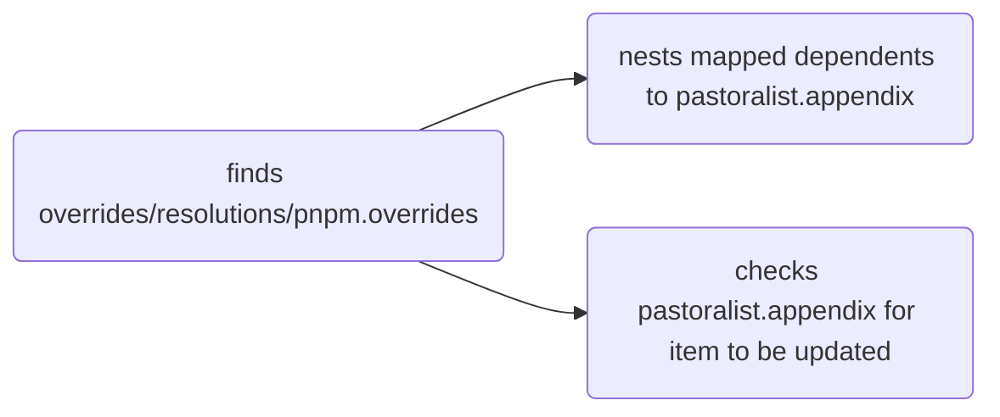
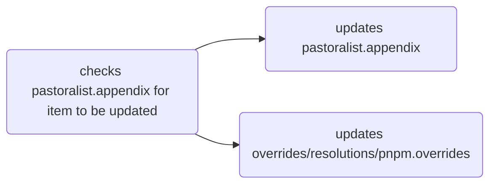

# Pastoralist


[](https://badge.fury.io/js/pastoralist)

[](https://github.com/yowainwright/mini-cookies)


A tool to watch over node module **`*overrides and resolutions`** with ease. 🐑 👩🏽‍🌾

---

#### \*Overrides and resolutions

Overrides and resolutions solve the same problem—they give developers a way to specify the dependency versions downloaded to repository's `node_modules`. This is very convenient for specifying specific `node_module` versions and fixing security issues.

However, it is easy to lose track of why an override or resolution is specified.
This is an inconvenient problem when trying to maintain dependencies over time—**until now**!

---
## Synopsis

By running **Pastoralist** in a `pre-commit` hook or other command an override/resolution which looks like this:

```js
// package.json
"overrides": {
  "trim": "^0.0.3"
},
```

Will look like this:

```js
// package.json
"overrides": {
  "trim": "^0.0.3"
},
"pastoralist": {
  "appendix": {
    "trim@^0.0.3": {
      "dependenents": {
        "remark-parse": "4.0.0"
      }
    }
  }
}
```

By running this!

```sh
pastoralist
# oh hech yeah!
```

But there's more!

If **Pastoralist** is run and a `resolution` or `override` is no longer required
it will clean up itself and resolutions!

```js
// pastoralist finds and removes `trim` when/if it's no longer needed!
"overrides": {},
"pastoralist": {
  "appendix": {}
}
```

---

## How Pastoralist works

**Pastoralist** manages `overrides` and `resolutions` so you don't have to!

**Pastoralist** is comprised of a few functions which read **node_modules** `package.json` files and reduce overrides or resolutions within the root `package.json` into a single `pastoralist.appendix` object.

- **Pastoralist** adds an `pastoralist.appendix` with a list of "resolved" dependencies.
- Better yet, if Pastoralist observes an `override` or `resolution` is no longer needed, it removes it from `resolutions`, `overrides`, and the pastoralist `appendix` object.
- This means with **Pastoralist**, your **only** concern is adding dependencies to the `overrides` and `resolutions` objects.

### Key notes

- **Pastoralist** does **not** manage what is added to overrides and resolutions objects.
- **Pastoralist does** manage dependenceis that exists in a `package.json`'s overrides or resolutions objects.
  - **Pastoralist** will remove overrides and resolutions if they become unneeded according to child `package.json`'s spec!
- **View the [Pasture lifecycle doc](./docs/pasture-lifecycle.md)** to get some visuals into what Pastoralist has got going on!

---
## Install

```sh
npm install pastoralist --save-dev
# pastoralist does not expect to be a dependency! It's a tool!!!
```

---

## Usage

**Pastoralist** is built to be used as a CLI program and runs with a single word "pastoralist".`

```sh
pastoralist
# => That's it! Chack out your package json
```

**Pastoralist** can _and should be incorporated_ into your workflow—which ever way is best for you and your team's developer experience! 👌

---

### Pastoralist Object Anatomy

When **Pastoralist** is run in a respository with override or resolution dependencies, it will output a shape like below.

```js
// package.json
"pastoralist": {
  // the appendix contains mapped resolutions/overrides
  "appendix": {
    // the resolution/override is stringified with it's version
    "trim@^0.0.3": {
      // dependents cantain dependents which actuall require the override/resolution dependency
      "dependenents": {
        "remark-parse": "4.0.0"
      }
    }
  }
}
```

When ever **Pastoralist** is run again, it will check the `pastoralist.appendix` object and remove any resolutions/overrides that are no longer needed.

---

## Pasturalist Lifecycle

When **Pasturalist** is run, it does 2 things—**review** and **update** resolutions/overrides within a root `package.json` file.

1. **Review**
   - it creates/re-creates an appendix which is an appendix resolutions/overrides.
2. **Update**
   - it reviews the appendix for dependents which can be removed from resolutions/overrides.

---

### Review

**Pasturalist** creates a pastoralist object which maps `overrides/resolutions/pnpm.overrides` dependents to `pastoralist.appendix`.



---

### Update

**Pastoralist** checks `pastoralist.appendix` and removes unneeded `overrides/resolutions` from their corresponding declarations.



---
## Roadmap

**Updated `2022-08-06`**

- [ ] More tests (in progress)
- [ ] Provide more configuration options using a tool like [cosmiconfig](https://github.com/davidtheclark/cosmiconfig)
- [ ] Provide caveats, code examples, and more documentation
- **Note:** the shape of the `pastoralist` object may change rapidly currently to improve the API.
  - **However, Pastoralist** is built to work on it's own so, generally, you shouldn't worry about it!
