# [Pastoralist](https://jeffry.in/pastoralist/)


[](https://badge.fury.io/js/pastoralist)

[](https://codecov.io/gh/yowainwright/pastoralist)
[](https://github.com/yowainwright/pastoralist)

**Pastoralist IS *set-it-and-forget-it automation* for dependency overrides. Pastoralist automatically tracks, secures, and cleans up your `overrides`, `resolutions`, and `patches`. Pastoralist also provides an out-of-the-box solution for resolving dependency security alerts using the same pattern of overriding and tracking security vulnerabilities in node modules. This provides a dead simple, boring way to singularly maintain node module dependencies and security issues in dependencies.**

---

## TL;DR

One command. Three automations. Zero maintenance.

```bash
npm i pastoralist -D && pastoralist --init
```

- Auto-tracks why each override exists
- Auto-scans for security vulnerabilities
- Auto-removes unused overrides

---

## Table of Contents

- [What are overrides and resolutions?](#what-are-overrides-and-resolutions)
- [The Problem](#the-problem)
- [The Solution](#the-solution)
- [What Pastoralist Automates](#what-pastoralist-automates)
- [How Pastoralist Works](#how-pastoralist-works)
  - [Key Notes](#key-notes)
  - [Workspaces and Monorepos](#using-pastoralist-with-workspaces-and-monorepos)
- [Configuration](#configuration)
  - [Configuration Files](#configuration-files)
  - [Configuration Priority](#configuration-priority)
  - [Configuration Options](#configuration-options)
  - [Security Tracking](#security-tracking-in-appendix)
  - [Best Practices](#best-practices)
- [Setup](#setup)
  - [Additional Commands](#additional-commands)
- [Thanks](#thanks)

---

## What are overrides and resolutions?

**Package manager overrides and resolutions let you control exact dependency versions in your node_modules.**

Package managers (npm, yarn, pnpm, bun) use these to fix:
- Security vulnerabilities in nested dependencies
- Bugs in transitive dependencies
- Version conflicts

Read more: [npm overrides](https://docs.npmjs.com/cli/v8/configuring-npm/package-json#overrides), [yarn resolutions](https://yarnpkg.com/configuration/manifest#resolutions), [pnpm overrides](https://pnpm.io/package_json#pnpmoverrides), [bun overrides](https://bun.sh/docs/install/overrides)

---

## The Problem

You add overrides to fix a security alert or broken dependency:

```js
"overrides": {
  "lodash": "4.17.21"  // Why? What for? No idea anymore.
}
```

**Six months later, you have no clue:**

```mermaid
flowchart LR
    You[You] --> Question1{Why is this here?}
    Question1 --> Question2{What uses it?}
    Question2 --> Question3{Still needed?}
    Question3 --> Stuck[🤷 Just leave it...]

    style You fill:#e3f2fd
    style Stuck fill:#ffebee
```



You end up with ghost overrides haunting your package.json forever.

---

## The Solution

**Pastoralist automatically documents every override:**

```js
"overrides": {
  "trim": "^0.0.3"
},
"pastoralist": {
  "appendix": {
    "trim@^0.0.3": {
      "dependents": {
        "remark-parse": "4.0.0"  // ← Ah! remark-parse needs this
      }
    }
  }
}
```

No more mysteries. Every override is tracked.

```mermaid
flowchart LR
    Install[npm install] --> Auto[Pastoralist runs]
    Auto --> Track[Auto-tracks dependencies]
    Auto --> Scan[Auto-scans security]
    Auto --> Clean[Auto-removes unused]
    Track --> Done[✓ Done]
    Scan --> Done
    Clean --> Done

    style Install fill:#e3f2fd
    style Auto fill:#f3e5f5
    style Done fill:#e8f5e9
```



**Automatic cleanup:**

When trim is no longer needed, Pastoralist removes it automatically:

```js
"overrides": {},      // ← Cleaned up automatically
"pastoralist": {
  "appendix": {}
}
```

**Automatic security fixes:**

Run once with `--checkSecurity` enabled:

```js
"pastoralist": {
  "security": {
    "enabled": true,
    "provider": "osv"
  }
}
```

Then forget about it. Pastoralist handles everything:

```js
"overrides": {
  "lodash": "4.17.21"  // ← Auto-fixed CVE-2021-23337
},
"pastoralist": {
  "appendix": {
    "lodash@4.17.21": {
      "dependents": {"my-app": "lodash@^4.17.0"},
      "ledger": {
        "reason": "Security vulnerability CVE-2021-23337",
        "securityProvider": "osv"
      }
    }
  }
}
```

Set it. Forget it. Done.

---

## What Pastoralist Automates

### 1. Automatic Tracking

Pastoralist automatically documents every override, including nested dependencies.

```js
"overrides": {
  "pg": {
    "pg-types": "^4.0.1"  // Nested override
  }
}
```


**Result:**

```js
"pastoralist": {
  "appendix": {
    "pg-types@^4.0.1": {
      "dependents": {
        "my-app": "pg@^8.13.1 (nested override)"
      }
    }
  }
}
```

### 2. Automatic Security Scanning

Enable once. Pastoralist handles the rest.

```js
"pastoralist": {
  "security": {
    "enabled": true,
    "provider": "osv",
    "severityThreshold": "medium"
  }
}
```



```mermaid
flowchart TD
    Start([npm install]) --> Scan[Scan for vulnerabilities]
    Scan --> Detect{Found?}
    Detect -->|Yes| Fix[Auto-generate override]
    Detect -->|No| Done[✓ Done]
    Fix --> Done

    style Start fill:#e3f2fd
    style Fix fill:#fff3cd
    style Done fill:#e8f5e9
```

**Supported providers:**
- **OSV** (default) - No auth required
- **GitHub** - Requires token
- **Snyk** - Requires CLI
- **Socket** - Requires CLI

### 3. Automatic Cleanup

When dependencies are removed, Pastoralist removes their overrides automatically. No manual intervention required.

```mermaid
flowchart TD
    Start([Dependency removed]) --> Check[Check if override still needed]
    Check --> Remove[Auto-remove from overrides & appendix]
    Remove --> Done[✓ Cleaned up]

    style Start fill:#e3f2fd
    style Remove fill:#f3e5f5
    style Done fill:#e8f5e9
```



### 4. Automatic Patch Tracking

Works seamlessly with `patch-package`. Automatically links patches to overrides and warns about unused patches.

```js
"pastoralist": {
  "appendix": {
    "lodash@4.17.21": {
      "dependents": {"my-app": "lodash@^4.17.0"},
      "patches": ["patches/lodash+4.17.21.patch"]  // ← Auto-tracked
    }
  }
}
```

---

## How Pastoralist Works

**You:** Add an override when needed.

**Pastoralist:** Handles everything else automatically.


Add it to your postinstall script and forget about it:

```js
"scripts": {
  "postinstall": "pastoralist"
}
```

**For detailed architecture, code flows, and user journeys**, see [Architecture and User Journeys](docs/architecture-and-user-journeys.md)

### Key Notes

- **You control** what goes into overrides/resolutions
- **Pastoralist controls** tracking, security, and cleanup
- **Fully automatic** - runs on every install via postinstall hook


### Using Pastoralist with Workspaces and Monorepos

Pastoralist provides enhanced support for monorepo scenarios where overrides are defined at the root but dependencies exist in workspace packages.

#### Auto-Detection

If your `package.json` has a `workspaces` field, Pastoralist automatically scans workspace packages:

```json
{
  "workspaces": ["packages/*", "apps/*"],
  "overrides": {
    "lodash": "4.17.21"
  }
}
```

Run `pastoralist` and it automatically scans all workspace packages. No configuration needed.

#### Manual Configuration

For explicit control, configure workspace scanning:

```json
{
  "pastoralist": {
    "depPaths": "workspace"
  }
}
```

Or specify custom paths:

```json
{
  "pastoralist": {
    "depPaths": ["packages/*/package.json", "apps/*/package.json"]
  }
}
```

#### Monorepo Override Tracking

When you have overrides at the root for packages only installed in workspace packages, Pastoralist tracks them properly:

```js
// Root package.json with overrides for workspace packages
{
  "overrides": {
    "lodash": "4.17.21"  // Used by workspace packages, not root
  },
  "pastoralist": {
    "overridePaths": {
      "packages/app-a/package.json": {
        "lodash@4.17.21": {
          "dependents": {
            "app-a": "lodash@^4.17.0"
          }
        }
      }
    }
  }
}
```

#### Configuration Options

1. **Interactive Configuration** - Let Pastoralist guide you through setup:
```bash
# Initialize with interactive prompts
pastoralist --init

# Or use --interactive when overrides are detected
pastoralist --interactive
```

When Pastoralist detects overrides for packages not in root dependencies, it will:
- Prompt you to configure workspace paths
- Offer to auto-detect common monorepo structures
- Allow you to specify custom paths
- Optionally save the configuration to your package.json

2. **Using depPaths CLI Flag** - Specify paths to scan for package.json files:
```bash
pastoralist --depPaths "packages/*/package.json" "apps/*/package.json"
```

3. **Using depPaths in package.json** - Configure dependency paths directly in your package.json:
```js
"pastoralist": {
  "depPaths": "workspace"  // Automatically uses all workspaces
}

// OR specify custom paths
"pastoralist": {
  "depPaths": ["packages/*/package.json", "apps/*/package.json"]
}
```

When using `depPaths: "workspace"`, Pastoralist will automatically scan all packages defined in your `workspaces` field. This is the recommended approach for most monorepos as it keeps your configuration in sync with your workspace structure.

Benefits of using `depPaths` configuration:
- Single source of truth in package.json
- No need to remember CLI flags
- Works automatically with postinstall scripts
- Appendix only appears in root package.json (workspace packages remain clean)

4. **Using overridePaths/resolutionPaths** - Configure in your package.json:
```js
"pastoralist": {
  "overridePaths": {  // or "resolutionPaths" for yarn
    "packages/app-a/package.json": { /* appendix for app-a */ },
    "packages/app-b/package.json": { /* appendix for app-b */ }
  }
}
```

This configuration ensures that:
- Overrides for packages not in root dependencies are preserved
- Each workspace package's usage is tracked separately
- The appendix correctly maps overrides to their actual consumers

---

## Configuration

Pastoralist supports multiple configuration methods to fit your project's needs. Configuration can be defined in external files or directly in your `package.json`.

### Configuration Files

Pastoralist searches for configuration files in this order (first found wins):

1. `.pastoralistrc` (JSON format)
2. `.pastoralistrc.json`
3. `pastoralist.json`
4. `pastoralist.config.js`
5. `pastoralist.config.ts`

**Example `.pastoralistrc.json`:**

```json
{
  "checkSecurity": true,
  "depPaths": "workspaces",
  "security": {
    "provider": "osv",
    "severityThreshold": "medium"
  }
}
```

**Example `pastoralist.config.js`:**

```js
module.exports = {
  checkSecurity: true,
  depPaths: ["packages/*/package.json", "apps/*/package.json"],
  security: {
    provider: "osv",
    severityThreshold: "high",
    excludePackages: ["@types/*"]
  }
};
```

**Example `pastoralist.config.ts`:**

```ts
import { PastoralistConfig } from 'pastoralist';

const config: PastoralistConfig = {
  checkSecurity: true,
  depPaths: "workspaces",
  security: {
    provider: "osv",
    severityThreshold: "critical"
  }
};

export default config;
```

### Configuration Priority

When both external config files and `package.json` configuration exist:

1. **External config** provides base settings
2. **`package.json`** overrides top-level fields
3. **Nested objects** (like `security`) are deep merged

**Example:**

```js
// .pastoralistrc.json
{
  "checkSecurity": true,
  "depPaths": "workspaces",
  "security": {
    "provider": "osv",
    "severityThreshold": "medium"
  }
}

// package.json
{
  "pastoralist": {
    "security": {
      "severityThreshold": "high"  // Overrides "medium" from .pastoralistrc.json
    }
  }
}

// Effective config:
{
  "checkSecurity": true,
  "depPaths": "workspaces",
  "security": {
    "provider": "osv",
    "severityThreshold": "high"  // From package.json
  }
}
```

### Configuration Options

| Option | Type | Description |
|--------|------|-------------|
| `checkSecurity` | `boolean` | Enable security vulnerability scanning |
| `depPaths` | `"workspace"` \| `"workspaces"` \| `string[]` | Paths to scan for dependencies in monorepos |
| `appendix` | `object` | Auto-generated dependency tracking (managed by Pastoralist) |
| `overridePaths` | `object` | Manual override tracking for specific paths |
| `resolutionPaths` | `object` | Manual resolution tracking for specific paths |
| `security` | `object` | Security scanning configuration (see below) |

#### Security Configuration

| Option | Type | Description |
|--------|------|-------------|
| `enabled` | `boolean` | Enable/disable security checks |
| `provider` | `"osv"` \| `"github"` \| `"snyk"` \| `"npm"` \| `"socket"` | Security provider (currently only OSV) |
| `autoFix` | `boolean` | Automatically apply security fixes |
| `interactive` | `boolean` | Use interactive mode for security fixes |
| `securityProviderToken` | `string` | API token for providers that require auth |
| `severityThreshold` | `"low"` \| `"medium"` \| `"high"` \| `"critical"` | Minimum severity level to report |
| `excludePackages` | `string[]` | Packages to exclude from security checks |
| `hasWorkspaceSecurityChecks` | `boolean` | Include workspace packages in scans |

### Security Tracking in Appendix

When security vulnerabilities are detected and fixed, Pastoralist tracks complete vulnerability information in the appendix ledger:

```js
"pastoralist": {
  "appendix": {
    "lodash@4.17.21": {
      "dependents": {
        "my-app": "lodash@^4.17.0"
      },
      "ledger": {
        "addedDate": "2024-01-15T10:30:00.000Z",
        "reason": "Security vulnerability CVE-2021-23337",
        "securityChecked": true,
        "securityCheckDate": "2024-01-15T10:30:00.000Z",
        "securityProvider": "osv",
        "cve": "CVE-2021-23337",
        "severity": "high",
        "description": "Command injection in lodash",
        "url": "https://nvd.nist.gov/vuln/detail/CVE-2021-23337"
      }
    }
  }
}
```

The ledger tracks:
- `addedDate`: When the override was first added
- `reason`: Why the override was needed
- `securityChecked`: Whether a security check was performed
- `securityCheckDate`: When the last security check occurred
- `securityProvider`: Which provider detected the vulnerability
- `cve`: CVE identifier (if applicable)
- `severity`: Vulnerability severity level (low, medium, high, critical)
- `description`: Brief description of the vulnerability
- `url`: Link to full vulnerability details

This complete audit trail lets you understand exactly which security issues were fixed and provides full context for future reference.

### Best Practices

1. **Use external config files** for shared settings across teams
2. **Use `package.json`** for project-specific overrides
3. **Commit config files** to version control
4. **Use `depPaths: "workspaces"`** for most monorepos
5. **Enable security checks** in CI/CD pipelines with `--checkSecurity`

---

## Setup

> #### Okay! Hopefully the breakdowns above were clear enough on why you might want to use Pastoralist!

Please submit a [pull request](https://github.com/yowainwright/pastoralist/pulls) or [issue](https://github.com/yowainwright/pastoralist/issues) if it wasn't!

Now for the super simple setup!

1. Install

```bash
npm install pastoralist --save-dev
# pastoralist does not expect to be a dependency! It's a tool!!!
```

2. run

```bash
pastoralist
# => That's it! Check out your package.json
```

3. (recommended) add Pastoralist to a postInstall script

```js
// package.json
{
  "scripts": {
    "postinstall": "pastoralist"
  }
}
```

### Additional Commands

**Preview changes without writing to package.json:**

```bash
pastoralist --dry-run
```

This shows exactly what Pastoralist would change without modifying any files. Useful for understanding changes before applying them.

**Set up automated CI/CD security checks:**

```bash
pastoralist init-ci
```

This generates a GitHub Actions workflow that:
- Runs on pull requests and pushes to main/master
- Runs weekly security scans
- Auto-detects your package manager (npm, yarn, pnpm, bun)
- Fails if package.json changes are uncommitted
- Comments on PRs when changes are needed

The workflow file is created at `.github/workflows/pastoralist.yml`. Commit it to enable automated security checks in CI.

---

## Thanks

Shout out to [Bryant Cabrera](https://github.com/bryantcabrera) and the infamous [Mardin](https://github.com/mardinyadegar) for all the fun conversation, insights, and pairing around this topic.

---

Made by [@yowainwright](https://github.com/yowainwright) for fun with passion! MIT, 2022
