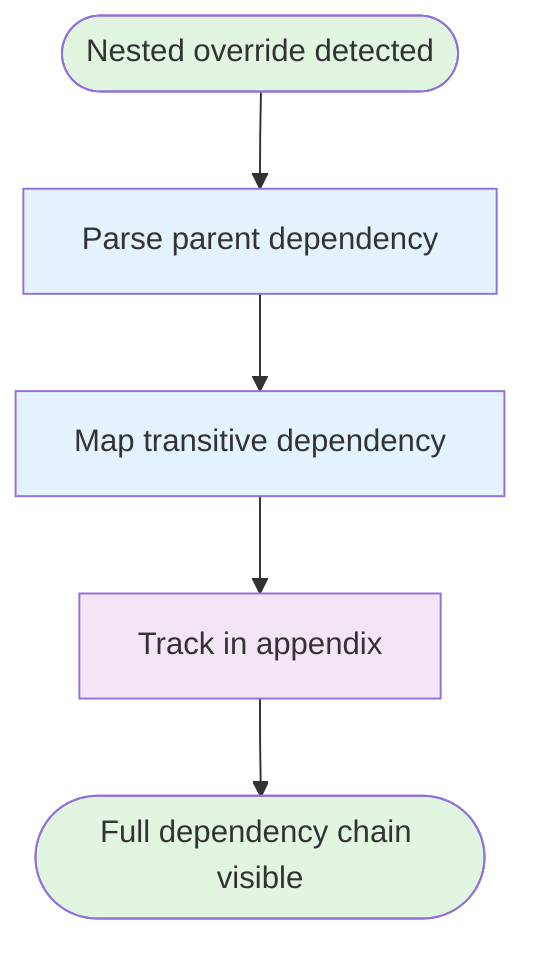

# [Pastoralist](https://jeffry.in/pastoralist/)


[](https://badge.fury.io/js/pastoralist)

[](https://codecov.io/gh/yowainwright/pastoralist)
[](https://github.com/yowainwright/pastoralist)

**Automatically track and clean up your repos security dependency issues AND package.json `overrides`, `resolutions`, and `patches`**

---

## Table of Contents

- [What are overrides and resolutions?](#what-are-overrides-and-resolutions)
- [Why is Pastoralist Awesome?](#why-is-pastoralist-awesome)
  - [New Features](#-new-features)
- [How Pastoralist Works](#how-pastoralist-works)
  - [Key Notes](#key-notes)
  - [Workspaces and Monorepos](#using-pastoralist-with-workspaces-and-monorepos)
- [Configuration](#configuration)
  - [Configuration Files](#configuration-files)
  - [Configuration Priority](#configuration-priority)
  - [Configuration Options](#configuration-options)
  - [Security Tracking](#security-tracking-in-appendix)
  - [Best Practices](#best-practices)
- [Setup](#setup)
- [Testing](#testing)
- [Examples](#examples)
  - [Simple Overrides](#simple-overrides)
  - [Nested Overrides](#nested-overrides-transitive-dependencies)
  - [Monorepo with depPaths](#monorepo-with-deppaths-configuration)
- [Pastoralist Object Anatomy](#pastoralist-object-anatomy)
- [Thanks](#thanks)

---

## What are overrides and resolutions?

**Package manager overrides and resolutions let you control exact dependency versions in your node_modules.**

Package managers (npm, yarn, pnpm, bun) use these to fix:
- Security vulnerabilities in nested dependencies
- Bugs in transitive dependencies
- Version conflicts

Read more: [npm overrides](https://docs.npmjs.com/cli/v8/configuring-npm/package-json#overrides), [yarn resolutions](https://yarnpkg.com/configuration/manifest#resolutions), [pnpm overrides](https://pnpm.io/package_json#pnpmoverrides), [bun overrides](https://bun.sh/docs/install/overrides)

---

## The Problem

You add overrides to fix issues:

```js
"overrides": {
  "trim": "^0.0.3",
  "lodash": "4.17.21",
  "some-package": "2.0.0"
}
```

Six months later:
- Why are these here?
- What uses them?
- Are they still needed?
- Which ones can I remove?

---

## The Solution

With Pastoralist CLI, an overrides object that looks like this:

```js
// Note the trim dependency in overrides
"overrides": {
  "trim": "^0.0.3"
},
```

Will look like this:

```js
// Note the trim dependency is now added to the appendix
"overrides": {
  "trim": "^0.0.3"
},
"pastoralist": {
  "appendix": {
    "trim@^0.0.3": {
      "dependents": {
        "remark-parse": "4.0.0"
      }
    }
  }
}
```

Now you know exactly why it exists and what needs it.

When an override is no longer required, Pastoralist automatically removes it:

```js
// Note that since trim is no longer needed,
// it has been removed from the appendix and overrides
"overrides": {},
"pastoralist": {
  "appendix": {}
}
```

**Security vulnerability detection:**

Run `pastoralist --checkSecurity` to scan for vulnerabilities via OSV API. Pastoralist will:
1. Call https://api.osv.dev/v1/query for each dependency
2. Detect vulnerable packages
3. Automatically create overrides with patched versions
4. Track the security fix in the appendix ledger

```js
// After running pastoralist --checkSecurity
"overrides": {
  "lodash": "4.17.21"  // Auto-generated security fix
},
"pastoralist": {
  "appendix": {
    "lodash@4.17.21": {
      "dependents": {
        "my-app": "lodash@^4.17.0"
      },
      "ledger": {
        "reason": "Security vulnerability CVE-2021-23337",
        "securityProvider": "osv",
        "addedDate": "2024-01-15T10:30:00.000Z"
      }
    }
  }
}
```

---

## Features

### Nested Overrides (Transitive Dependencies)

Sometimes you need to override a dependency of a dependency. Pastoralist tracks the full dependency chain so you know exactly which parent package requires the nested override.



**Example:**

```js
// Override a transitive dependency of pg
"overrides": {
  "pg": {
    "pg-types": "^4.0.1"
  }
}
```

**Tracked in appendix:**

```js
"pastoralist": {
  "appendix": {
    "pg-types@^4.0.1": {
      "dependents": {
        "my-app": "pg@^8.13.1 (nested override)"
      }
    }
  }
}
```

### Security Vulnerability Detection

Automatically scan for security vulnerabilities and create overrides to fix them. Supports multiple security providers: OSV (default), GitHub, Snyk, and Socket.


**Usage:**

```bash
pastoralist --checkSecurity                           # Scan and report
pastoralist --checkSecurity --forceSecurityRefactor   # Auto-apply fixes
pastoralist --checkSecurity --interactive             # Choose which fixes to apply
pastoralist --checkSecurity --includeWorkspaces       # Include workspace packages
```

**Configuration:**

```js
"pastoralist": {
  "security": {
    "enabled": true,                      // Enable security checks (default: false)
    "provider": "osv",                    // Security provider: "osv", "github", "snyk", "socket" (default: "osv")
    "autoFix": false,                     // Automatically apply fixes (default: false)
    "interactive": false,                 // Use interactive mode (default: false)
    "securityProviderToken": "",          // Token for providers that require auth
    "hasWorkspaceSecurityChecks": false,  // Include workspace packages (default: false)
    "severityThreshold": "medium",        // Minimum severity: "low", "medium", "high", "critical" (default: "medium")
    "excludePackages": []                 // Packages to exclude from checks
  }
}
```

**Supported providers:**
- **OSV** (default) - [Open Source Vulnerabilities](https://osv.dev/) - No auth required
- **GitHub** - GitHub Dependabot alerts - Requires token
- **Snyk** - Snyk vulnerability database - Requires CLI
- **Socket** - Socket security analysis - Requires CLI

### Patch Detection and Tracking

Automatically detects and tracks patches from tools like `patch-package`. Links patches to their corresponding overrides and warns about unused patches.


**Example:**

```js
"pastoralist": {
  "appendix": {
    "lodash@4.17.21": {
      "dependents": {
        "my-app": "lodash@^4.17.0"
      },
      "patches": ["patches/lodash+4.17.21.patch"]
    }
  }
}
```

**Unused patch warning:**

```
🐑 Found 2 potentially unused patch files:
  - patches/old-package+1.0.0.patch
Consider removing these patches if the packages are no longer used.
```

### Complete Dependency Tracking

Tracks all dependency types: `dependencies`, `devDependencies`, and `peerDependencies`. Ensures every override is mapped regardless of where the dependency is declared.


---

## How Pastoralist works

> #### Pastoralist manages overrides and resolutions so you don't have to!

It is comprised of a few functions which read the root package.json file's overrides or resolutions and map the packages in them to a `pastoralist.appendix` object.

If Pastoralist observes an override or resolution is no longer needed, it removes it from resolutions or overrides, and the pastoralist appendix object.

This means with Pastoralist, your only concern is adding dependencies to the overrides and resolutions objects.
Broken down, Pastoralist manages your overrides and resolutions with 4 simple steps demonstrated in the flow chart below.


### Key notes

1. Pastoralist does **not** manage what is added to overrides or resolutions objects.
2. Pastoralist **does** manage dependencies that exist in a `package.json`'s overrides or resolutions objects.
3. Pastoralist will remove overrides and resolutions if they become unneeded according to child package.json's spec!

**For detailed architecture diagrams and use cases**, see [Architecture Documentation](docs/architecture.md)

### Using Pastoralist with Workspaces and Monorepos

Pastoralist now provides enhanced support for monorepo scenarios where overrides are defined at the root but the overridden packages are installed in workspace packages.

#### Monorepo Override Tracking

When you have overrides at the root of a monorepo for packages that are only installed in workspace packages, Pastoralist can track these properly:

```js
// Root package.json with overrides for workspace packages
{
  "overrides": {
    "lodash": "4.17.21"  // Used by workspace packages, not root
  },
  "pastoralist": {
    "overridePaths": {
      "packages/app-a/package.json": {
        "lodash@4.17.21": {
          "dependents": {
            "app-a": "lodash@^4.17.0"
          }
        }
      }
    }
  }
}
```

#### Configuration Options

1. **Interactive Configuration** - Let Pastoralist guide you through setup:
```bash
# Initialize with interactive prompts
pastoralist --init

# Or use --interactive when overrides are detected
pastoralist --interactive
```

When Pastoralist detects overrides for packages not in root dependencies, it will:
- Prompt you to configure workspace paths
- Offer to auto-detect common monorepo structures
- Allow you to specify custom paths
- Optionally save the configuration to your package.json

2. **Using depPaths CLI Flag** - Specify paths to scan for package.json files:
```bash
pastoralist --depPaths "packages/*/package.json" "apps/*/package.json"
```

3. **Using depPaths in package.json** - Configure dependency paths directly in your package.json:
```js
"pastoralist": {
  "depPaths": "workspace"  // Automatically uses all workspaces
}

// OR specify custom paths
"pastoralist": {
  "depPaths": ["packages/*/package.json", "apps/*/package.json"]
}
```

When using `depPaths: "workspace"`, Pastoralist will automatically scan all packages defined in your `workspaces` field. This is the recommended approach for most monorepos as it keeps your configuration in sync with your workspace structure.

Benefits of using `depPaths` configuration:
- Single source of truth in package.json
- No need to remember CLI flags
- Works automatically with postinstall scripts
- Appendix only appears in root package.json (workspace packages remain clean)

4. **Using overridePaths/resolutionPaths** - Configure in your package.json:
```js
"pastoralist": {
  "overridePaths": {  // or "resolutionPaths" for yarn
    "packages/app-a/package.json": { /* appendix for app-a */ },
    "packages/app-b/package.json": { /* appendix for app-b */ }
  }
}
```

This configuration ensures that:
- Overrides for packages not in root dependencies are preserved
- Each workspace package's usage is tracked separately
- The appendix correctly maps overrides to their actual consumers

For detailed information about using Pastoralist in workspace/monorepo environments, including best practices and automation strategies, see [Workspaces and Monorepos](docs/workspaces.md).

---

## Configuration

Pastoralist supports multiple configuration methods to fit your project's needs. Configuration can be defined in external files or directly in your `package.json`.

### Configuration Files

Pastoralist searches for configuration files in this order (first found wins):

1. `.pastoralistrc` (JSON format)
2. `.pastoralistrc.json`
3. `pastoralist.json`
4. `pastoralist.config.js`
5. `pastoralist.config.ts`

**Example `.pastoralistrc.json`:**

```json
{
  "checkSecurity": true,
  "depPaths": "workspaces",
  "security": {
    "provider": "osv",
    "severityThreshold": "medium"
  }
}
```

**Example `pastoralist.config.js`:**

```js
module.exports = {
  checkSecurity: true,
  depPaths: ["packages/*/package.json", "apps/*/package.json"],
  security: {
    provider: "osv",
    severityThreshold: "high",
    excludePackages: ["@types/*"]
  }
};
```

**Example `pastoralist.config.ts`:**

```ts
import { PastoralistConfig } from 'pastoralist';

const config: PastoralistConfig = {
  checkSecurity: true,
  depPaths: "workspaces",
  security: {
    provider: "osv",
    severityThreshold: "critical"
  }
};

export default config;
```

### Configuration Priority

When both external config files and `package.json` configuration exist:

1. **External config** provides base settings
2. **`package.json`** overrides top-level fields
3. **Nested objects** (like `security`) are deep merged

**Example:**

```js
// .pastoralistrc.json
{
  "checkSecurity": true,
  "depPaths": "workspaces",
  "security": {
    "provider": "osv",
    "severityThreshold": "medium"
  }
}

// package.json
{
  "pastoralist": {
    "security": {
      "severityThreshold": "high"  // Overrides "medium" from .pastoralistrc.json
    }
  }
}

// Effective config:
{
  "checkSecurity": true,
  "depPaths": "workspaces",
  "security": {
    "provider": "osv",
    "severityThreshold": "high"  // From package.json
  }
}
```

### Configuration Options

| Option | Type | Description |
|--------|------|-------------|
| `checkSecurity` | `boolean` | Enable security vulnerability scanning |
| `depPaths` | `"workspace"` \| `"workspaces"` \| `string[]` | Paths to scan for dependencies in monorepos |
| `appendix` | `object` | Auto-generated dependency tracking (managed by Pastoralist) |
| `overridePaths` | `object` | Manual override tracking for specific paths |
| `resolutionPaths` | `object` | Manual resolution tracking for specific paths |
| `security` | `object` | Security scanning configuration (see below) |

#### Security Configuration

| Option | Type | Description |
|--------|------|-------------|
| `enabled` | `boolean` | Enable/disable security checks |
| `provider` | `"osv"` \| `"github"` \| `"snyk"` \| `"npm"` \| `"socket"` | Security provider (currently only OSV) |
| `autoFix` | `boolean` | Automatically apply security fixes |
| `interactive` | `boolean` | Use interactive mode for security fixes |
| `securityProviderToken` | `string` | API token for providers that require auth |
| `severityThreshold` | `"low"` \| `"medium"` \| `"high"` \| `"critical"` | Minimum severity level to report |
| `excludePackages` | `string[]` | Packages to exclude from security checks |
| `hasWorkspaceSecurityChecks` | `boolean` | Include workspace packages in scans |

### Security Tracking in Appendix

When security vulnerabilities are detected and fixed, Pastoralist tracks this information in the appendix ledger:

```js
"pastoralist": {
  "appendix": {
    "lodash@4.17.21": {
      "dependents": {
        "my-app": "lodash@^4.17.0"
      },
      "ledger": {
        "addedDate": "2024-01-15T10:30:00.000Z",
        "reason": "Security vulnerability CVE-2021-23337",
        "securityChecked": true,
        "securityCheckDate": "2024-01-15T10:30:00.000Z",
        "securityProvider": "osv"
      }
    }
  }
}
```

The ledger tracks:
- `addedDate`: When the override was first added
- `reason`: Why the override was needed (e.g., security issue description)
- `securityChecked`: Whether a security check was performed
- `securityCheckDate`: When the last security check occurred
- `securityProvider`: Which provider detected the vulnerability

This allows you to see at a glance which packages were overridden due to security issues and when they were last verified.

### Best Practices

1. **Use external config files** for shared settings across teams
2. **Use `package.json`** for project-specific overrides
3. **Commit config files** to version control
4. **Use `depPaths: "workspaces"`** for most monorepos
5. **Enable security checks** in CI/CD pipelines with `--checkSecurity`

---

## Setup

> #### Okay! Hopefully the breakdowns above were clear enough on why you might want to use Pastoralist!

Please submit a [pull request](https://github.com/yowainwright/pastoralist/pulls) or [issue](https://github.com/yowainwright/pastoralist/issues) if it wasn't!

Now for the super simple setup!

1. Install

```bash
npm install pastoralist --save-dev
# pastoralist does not expect to be a dependency! It's a tool!!!
```

2. run

```bash
pastoralist
# => That's it! Check out your package.json
```

3. (recommended) add Pastoralist to a postInstall script

```js
// package.json
{
  "scripts": {
    "postinstall": "pastoralist"
  }
}
```

---

## Thanks

Shout out to [Bryant Cabrera](https://github.com/bryantcabrera) and the infamous [Mardin](https://github.com/mardinyadegar) for all the fun conversation, insights, and pairing around this topic.

---

Made by [@yowainwright](https://github.com/yowainwright) for fun with passion! MIT, 2022
