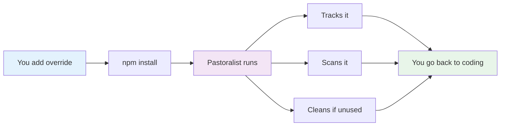
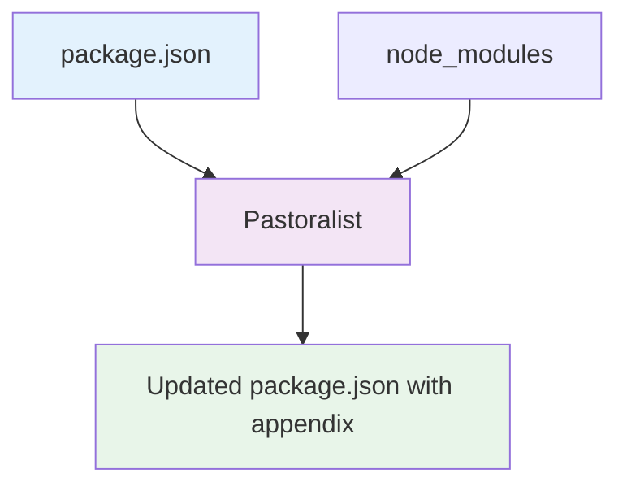
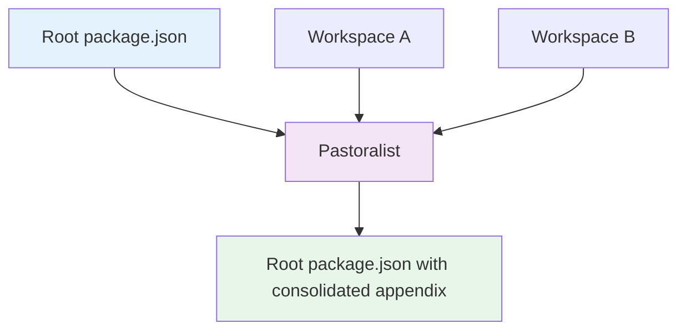
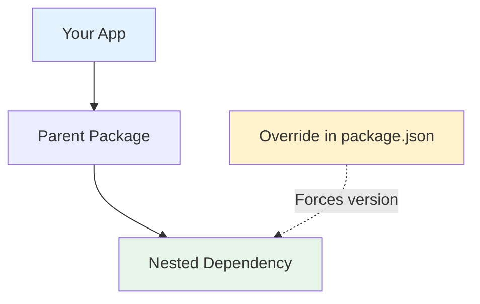
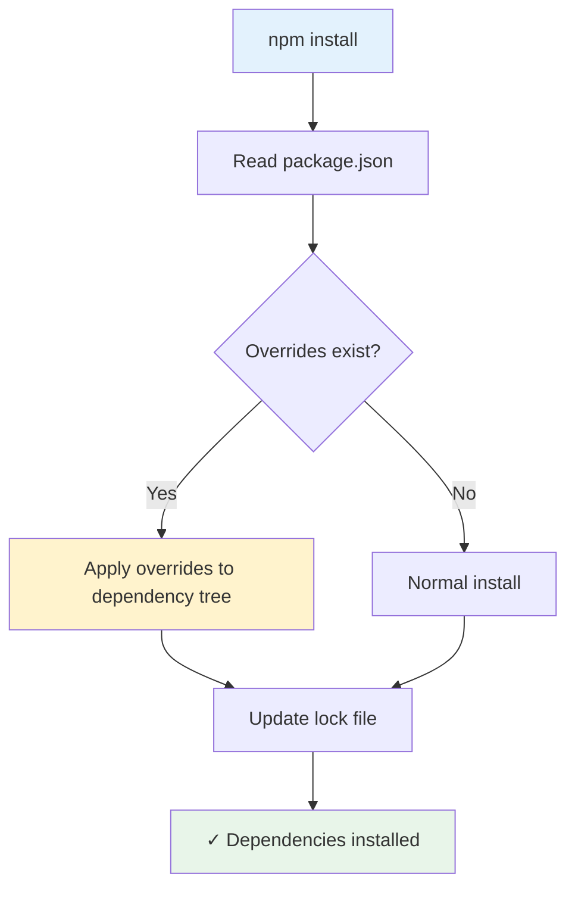

## How Pastoralist Works



Pastoralist manages overrides, resolutions, and patches so you don't have to!

It is comprised of a few functions which read the root package.json file's overrides or resolutions and map the packages in them to a `pastoralist.appendix` object. Additionally, it automatically detects and tracks patches in your project (such as those created by `patch-package`).

If Pastoralist observes an override, resolution, or patch is no longer needed, it removes it from the respective objects and the pastoralist appendix object, and notifies you about unused patches.

This means with Pastoralist, your only concern is adding dependencies to the overrides and resolutions objects - patch tracking happens automatically.

### Workspace Support

In workspace/monorepo setups, Pastoralist:

- Reads the root package.json or project manifest file
- Maps all overrides, resolutions, and patches to the `pastoralist.appendix` object
- Updates dependencies across all workspaces
- Maintains consistency throughout your monorepo

## Simple Project Architecture

Standard single-package project with overrides:



## Monorepo Architecture

Complex workspace setup with shared overrides:



## What Are Overrides, Resolutions, and Patches?

### Overrides (npm)

Overrides allow you to replace a package version in your dependency tree with a different version. This is npm's way of handling dependency conflicts:

```json
{
  "overrides": {
    "foo": "1.0.0",
    "bar": {
      "baz": "1.0.0"
    }
  }
}
```

### Resolutions (Yarn)

Resolutions serve the same purpose for Yarn users, allowing you to force specific versions:

```json
{
  "resolutions": {
    "foo": "1.0.0",
    "**/bar/baz": "1.0.0"
  }
}
```

### Patches

Patches are custom modifications to node_modules packages, typically created with tools like `patch-package`. Pastoralist automatically detects and tracks these patches.

## Object Anatomy

The Pastoralist object in your package.json provides full transparency into what's being managed:

```json
{
  "overrides": {
    "minimist": "1.2.8"
  },
  "pastoralist": {
    "appendix": {
      "minimist": {
        "key": "minimist",
        "version": "1.2.8",
        "parentKeys": [".", "mkdirp"],
        "hasOverride": true,
        "hasResolution": false,
        "hasPatch": false
      }
    }
  }
}
```

### Appendix Properties

- **key**: The package name
- **version**: Current override version
- **parentKeys**: Where this dependency appears in your tree
- **hasOverride**: Whether an npm override exists
- **hasResolution**: Whether a Yarn resolution exists
- **hasPatch**: Whether a patch file exists

## Nested Override Architecture

How nested overrides work for transitive dependencies:



## Design Decisions

### Synchronous I/O

Pastoralist uses sync file I/O intentionally. As a CLI tool, predictable execution and simple debugging outweigh async benefits.

### Caching

Two caches avoid redundant work: `jsonCache` (parsed package.json files) and `dependencyTreeCache` (npm ls output). Caches persist across `update()` calls - pass `clearCache: true` to reset.

### Rate Limiting

npm registry requests are limited to 5 concurrent to avoid rate limits during security scans.

## Dependency Resolution Flow

Complete flow of how dependencies are resolved with overrides:


