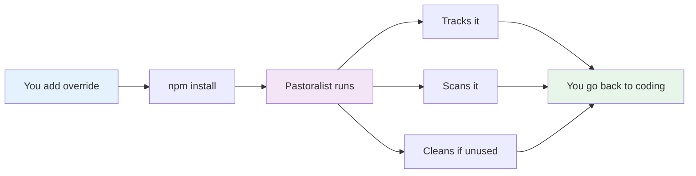
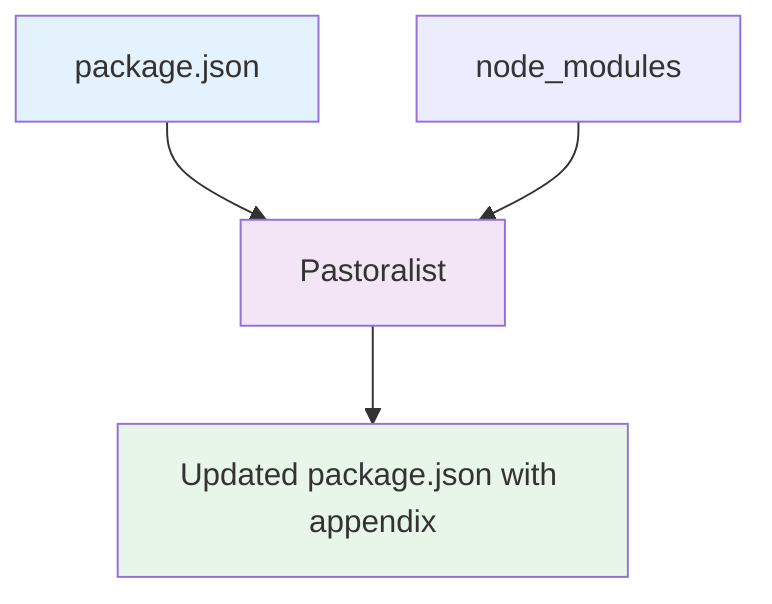
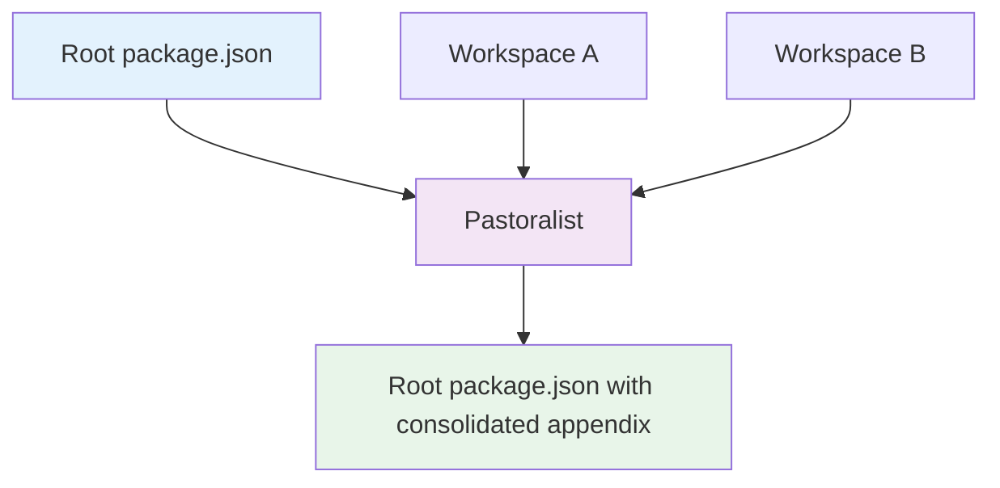
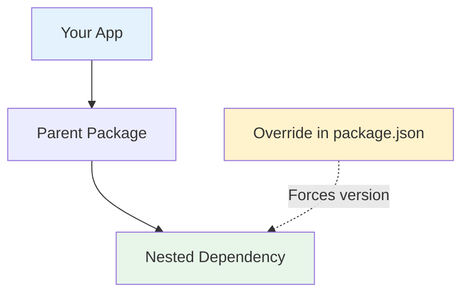
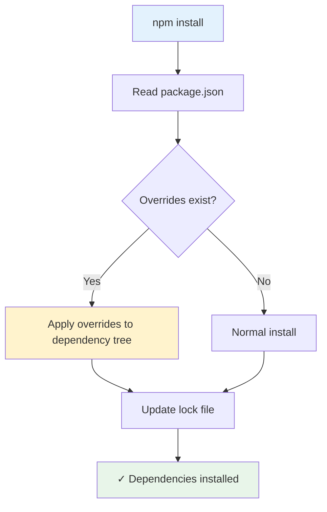

## How Pastoralist Works


```mermaid
flowchart LR
    You[You add override] --> Install[npm install]
    Install --> Pastor[Pastoralist runs]
    Pastor --> Track[Tracks it]
    Pastor --> Scan[Scans it]
    Pastor --> Clean[Cleans if unused]
    Track --> Chill[You go back to coding]
    Scan --> Chill
    Clean --> Chill

    style You fill:#e3f2fd
    style Pastor fill:#f3e5f5
    style Chill fill:#e8f5e9
```

Pastoralist reads the root `package.json`, maps each override or resolution into
a `pastoralist.appendix` entry, and records when the entry was created in its
`ledger`. Patches created by tools such as `patch-package` are detected and
tracked on the same entry.

If an override or resolution is no longer needed, Pastoralist marks the appendix
entry as unused and prints a cleanup notice. The override and its appendix entry
are removed only when you run with `--remove-unused`. Patch files are reported
as potentially unused; Pastoralist does not delete patch files for you.

You manage the override or resolution field; Pastoralist manages the appendix.

### Workspace Support

In workspace/monorepo setups, Pastoralist:

- Reads the root package.json or project manifest file
- Maps overrides, resolutions, and patches to the `pastoralist.appendix`, with a
  `ledger` entry recording when each override was added
- Reads workspace package manifests when `depPaths` or `workspaces` are configured
- Writes the consolidated appendix to the target package.json, usually the root

## Simple Project Architecture

Standard single-package project with overrides:


```mermaid
flowchart TD
    PkgJson[package.json] --> Pastoralist[Pastoralist]
    NodeModules[node_modules] --> Pastoralist
    Pastoralist --> UpdatedPkg[Updated package.json with appendix]

    style PkgJson fill:#e3f2fd
    style Pastoralist fill:#f3e5f5
    style UpdatedPkg fill:#e8f5e9
```

## Monorepo Architecture

Complex workspace setup with shared overrides:


```mermaid
flowchart TD
    Root[Root package.json] --> Pastoralist[Pastoralist]
    WS1[Workspace A] --> Pastoralist
    WS2[Workspace B] --> Pastoralist
    Pastoralist --> Output[Root package.json with consolidated appendix]

    style Root fill:#e3f2fd
    style Pastoralist fill:#f3e5f5
    style Output fill:#e8f5e9
```

## What Are Overrides, Resolutions, and Patches?

### Overrides (npm)

Overrides allow you to replace a package version in your dependency tree with a different version. This is npm's way of handling dependency conflicts:

```json
{
  "overrides": {
    "foo": "1.0.0",
    "bar": {
      "baz": "1.0.0"
    }
  }
}
```

### Resolutions (Yarn)

Resolutions serve the same purpose for Yarn users, allowing you to force specific versions:

```json
{
  "resolutions": {
    "foo": "1.0.0",
    "**/bar/baz": "1.0.0"
  }
}
```

### Patches

Patches are custom modifications to node_modules packages, typically created with tools like `patch-package`. Pastoralist automatically detects and tracks these patches.

## Object Anatomy

The Pastoralist object in your package.json provides full transparency into what's being managed:

```json
{
  "overrides": {
    "minimist": "1.2.8"
  },
  "pastoralist": {
    "appendix": {
      "minimist@1.2.8": {
        "dependents": {
          "my-app": "minimist@^1.2.6",
          "mkdirp": "minimist@^1.2.5"
        },
        "ledger": {
          "addedDate": "2026-05-30T00:00:00.000Z",
          "reason": "Pin minimist while upstream packages adopt the patched version.",
          "source": "manual"
        }
      }
    }
  }
}
```

### Appendix Properties

- **appendix key**: The package and override version, such as `minimist@1.2.8`
- **dependents**: Direct, workspace, or transitive packages that still require the override
- **patches**: Patch files associated with the package, when any are detected
- **ledger**: Always present on entries written by current Pastoralist. Holds
  `addedDate`, optional `reason` and `source`, security metadata (`securityProvider`,
  `cves`, `cveDetails`, `severity`, `vulnerableRange`, `patchedVersion`), and
  optional `keep` constraints

## Nested Override Architecture

How nested overrides work for transitive dependencies:


```mermaid
flowchart TD
    App[Your App] --> ParentPkg[Parent Package]
    ParentPkg --> NestedDep[Nested Dependency]
    Override[Override in package.json] -.->|Forces version| NestedDep

    style App fill:#e3f2fd
    style Override fill:#fff3cd
    style NestedDep fill:#e8f5e9
```

## Design Decisions

### Synchronous I/O

Pastoralist uses sync file I/O intentionally. As a CLI tool, predictable execution and simple debugging outweigh async benefits.

### Caching

Two caches avoid redundant work: `jsonCache` (parsed package.json files) and `dependencyTreeCache` (npm ls output). Caches persist across `update()` calls - pass `clearCache: true` to reset.

### Rate Limiting

npm registry requests are limited to 5 concurrent to avoid rate limits during security scans.

## Dependency Resolution Flow

Complete flow of how dependencies are resolved with overrides:


```mermaid
flowchart TD
    Install[npm install] --> ReadPkg[Read package.json]
    ReadPkg --> CheckOverrides{Overrides exist?}
    CheckOverrides -->|Yes| ApplyOverrides[Apply overrides to dependency tree]
    CheckOverrides -->|No| NormalInstall[Normal install]
    ApplyOverrides --> UpdateLock[Update lock file]
    NormalInstall --> UpdateLock
    UpdateLock --> Done[✓ Dependencies installed]

    style Install fill:#e3f2fd
    style ApplyOverrides fill:#fff3cd
    style Done fill:#e8f5e9
```
