# Architecture and User Journeys

This doc shows how Pastoralist works: the architecture, code flows, and common user journeys.

---

## 1. Architecture

### 1.1 Core Architecture

Pastoralist runs after npm install, analyzes your overrides, and maintains tracking automatically.

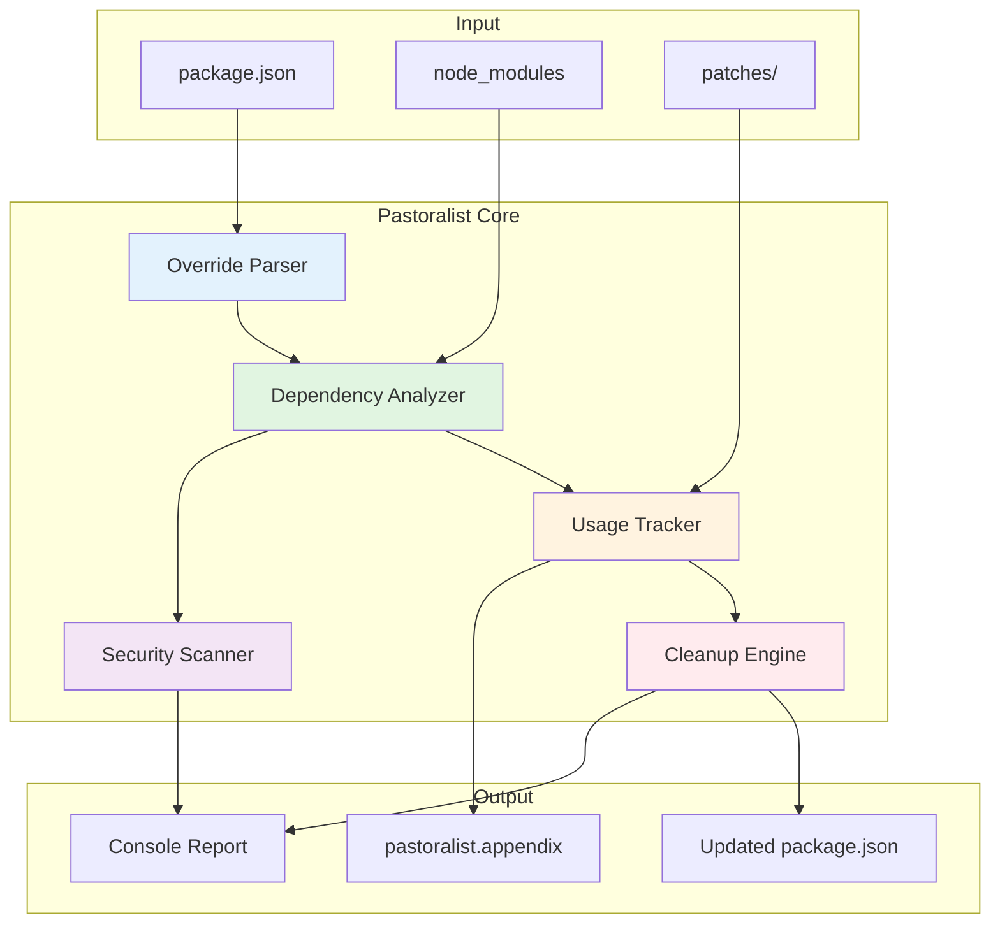

**Code References:**

| Component | Location | Function |
|-----------|----------|----------|
| Parser | `src/scripts.ts:463-489` | Override parsing |
| Analyzer | `src/scripts.ts:636-745` | Dependency analysis |
| Tracker | `src/scripts.ts:893-937` | Appendix tracking |
| Cleaner | `src/scripts.ts:212-266, 1290-1345` | Cleanup |
| Security | `src/security/index.ts:188-248` | Scanning |

---

### 1.2 Simple Project Architecture

For single-package projects, Pastoralist tracks what each override fixes.

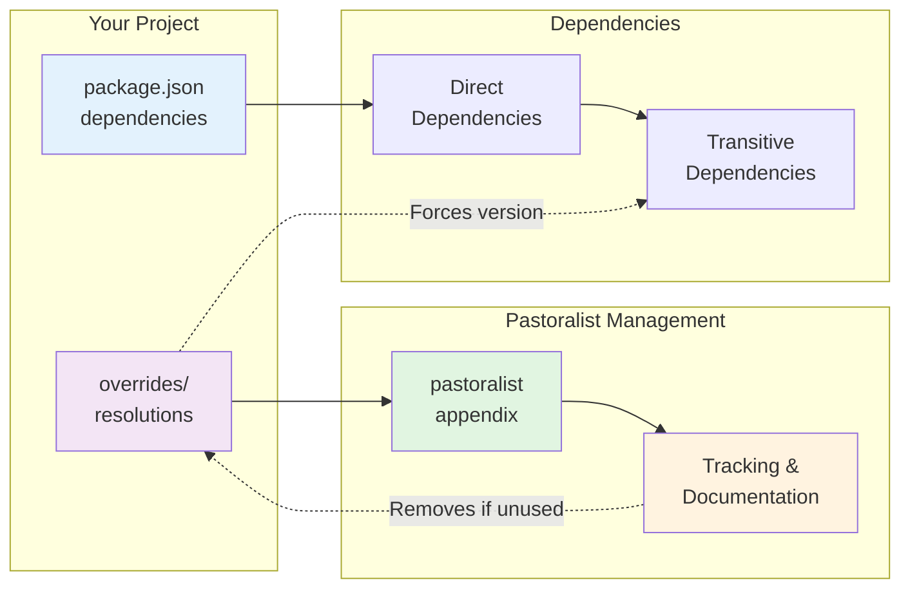

---

### 1.3 Monorepo Architecture

For monorepos, Pastoralist auto-detects workspaces and tracks which packages need each override.

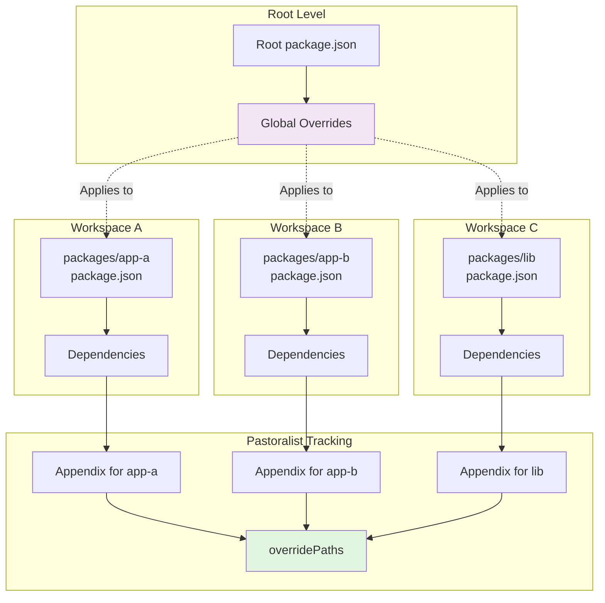

---

### 1.4 Security Vulnerability Management

Security scanning finds vulnerabilities, generates overrides, and tracks them with CVE details.

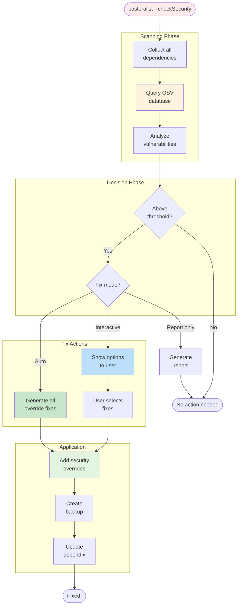

---

### 1.5 CI/CD Integration

Run `pastoralist init-ci` to generate GitHub Actions workflow for automated checks.

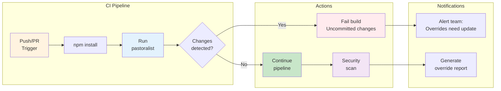

**Generated Workflow Example:**

```yaml
name: Pastoralist Security Check
on:
  pull_request:
    branches: [main, master]
  schedule:
    - cron: '0 0 * * 0'
jobs:
  security-check:
    runs-on: ubuntu-latest
    steps:
      - uses: actions/checkout@v4
      - name: Run Pastoralist security check
        run: npx pastoralist --checkSecurity
```

---

### 1.6 Override Lifecycle

Overrides are tracked from creation to automatic removal when no longer needed.

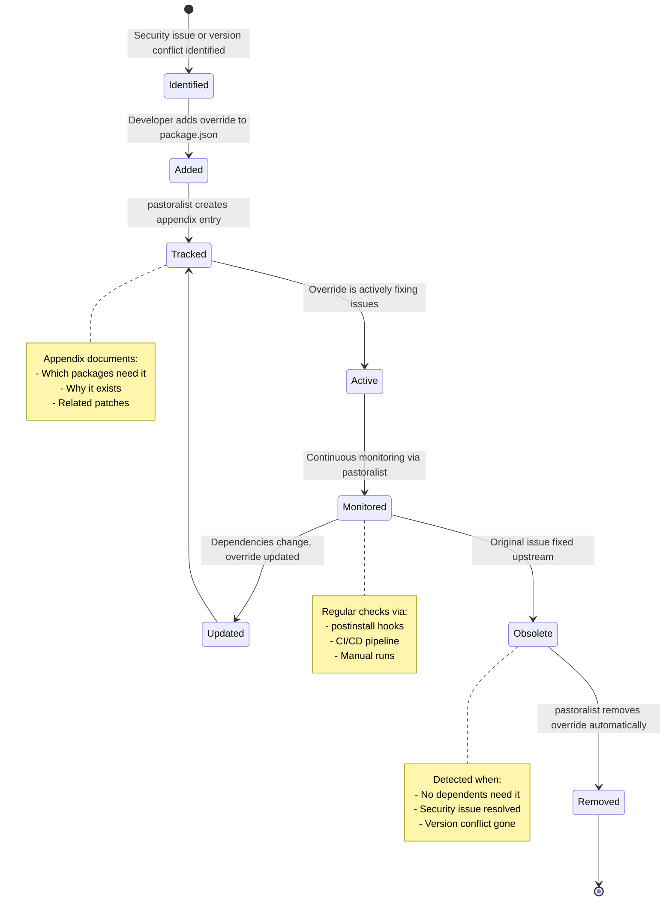

---

## 2. Code Flows

### 2.1 Override Tracking Flow

Every override is automatically tracked with which packages need it and why it exists.

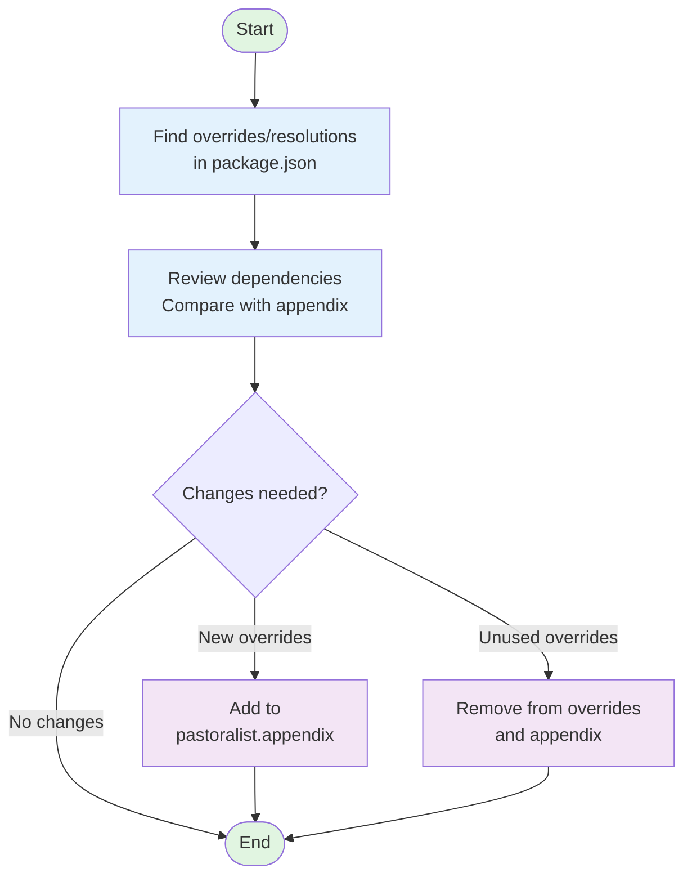

**Code Execution Path:**

```
program.ts:50 action()
  ↓
scripts.ts:463 update()
  ↓
scripts.ts:470 determineDepPaths() [workspace auto-detection]
  ↓
scripts.ts:636 updatePackageJSON()
  ↓
scripts.ts:893 createSecurityLedger() [enhanced with CVE details]
  ↓
scripts.ts:745 writeFileSync() or dryRun console.log
```

---

### 2.2 Security Scanning Flow

Security scanning runs on every install, checks for newer patches, and tracks full CVE details in the ledger.

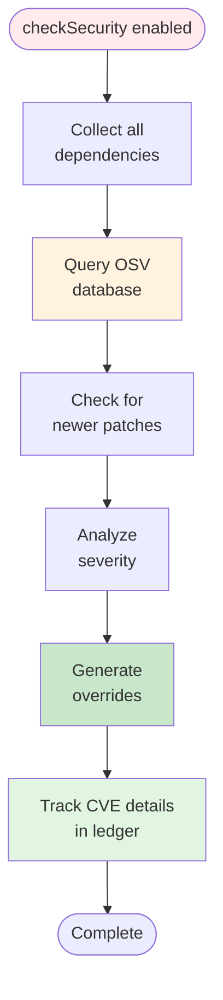

**Code Execution Path:**

```
program.ts:90 if (mergedOptions.checkSecurity)
  ↓
security/index.ts:105 checkSecurity()
  ↓
security/index.ts:188 checkOverrideUpdates() [NEW: detects newer patches]
  ↓
security/providers/osv.ts:45 fetchAlerts() [parallel API calls]
  ↓
security/index.ts:418 generateOverrides() [with CVE, severity, description, url]
  ↓
program.ts:116 securityOverrideDetails → scripts.ts:893
```

---

### 2.3 Workspace Auto-Detection Flow

Workspaces are auto-detected from package.json; no configuration needed.

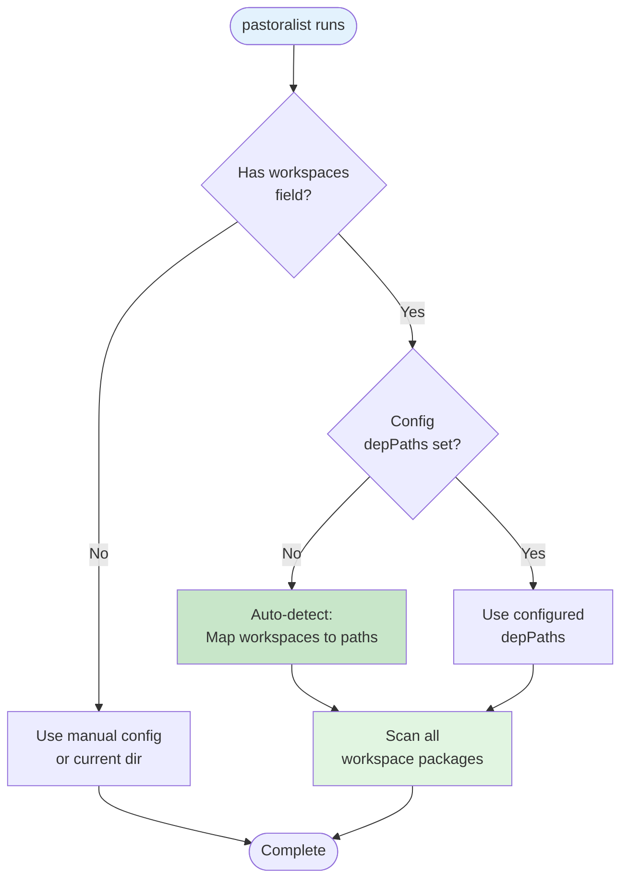

**Code Execution Path:**

```
scripts.ts:463 update()
  ↓
scripts.ts:470-478 Auto-detection logic:
  - Check if depPaths is undefined
  - Check if package.json has workspaces field
  - Check if config.pastoralist.depPaths is NOT set
  ↓
scripts.ts:475 Map workspaces to package.json paths:
  depPaths = config.workspaces!.map((ws: string) => `${ws}/package.json`)
  ↓
scripts.ts:636 updatePackageJSON() for each workspace
```

---

### 2.4 Cleanup Flow

When dependencies are removed, their overrides are automatically cleaned up.

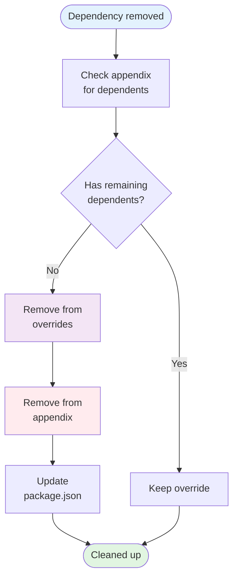

**Code Execution Path:**

```
scripts.ts:212 cleanupUnusedOverrides()
  ↓
scripts.ts:221 Check if override has dependents
  ↓
scripts.ts:245 Remove from overrides object
  ↓
scripts.ts:1290 removeUnusedOverrides()
  ↓
scripts.ts:1345 Update package.json
```

---

## 3. User Journeys

### 3.1 First-Time Setup

Install it. Run `pastoralist --init`. Add to postinstall. Never think about it again.

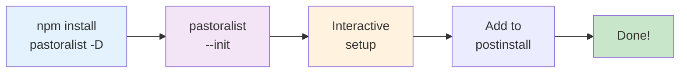

**.pastoralistrc:**

```json
{
  "checkSecurity": true,
  "security": {
    "enabled": true,
    "provider": "osv"
  }
}
```

**package.json:**

```json
{
  "scripts": {
    "postinstall": "pastoralist"
  }
}
```

---

### 3.2 Security Patch Management

A CVE drops. Pastoralist fixes it, tracks every detail, and removes it when upstream patches. You keep coding.

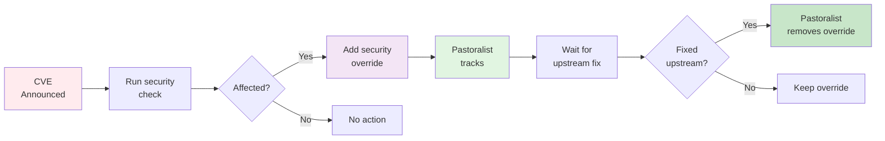

**.pastoralistrc:**

```json
{
  "checkSecurity": true,
  "security": {
    "enabled": true,
    "provider": "osv",
    "severityThreshold": "medium",
    "autoFix": true
  }
}
```

**Resulting package.json appendix:**

```json
{
  "pastoralist": {
    "appendix": {
      "lodash@4.17.21": {
        "dependents": {
          "my-app": "lodash@^4.17.0"
        },
        "ledger": {
          "reason": "Security vulnerability CVE-2021-23337",
          "cve": "CVE-2021-23337",
          "severity": "high",
          "description": "Command injection in lodash",
          "url": "https://nvd.nist.gov/vuln/detail/CVE-2021-23337",
          "securityProvider": "osv"
        }
      }
    }
  }
}
```

---

### 3.3 Monorepo Migration

Add a `workspaces` field. Run `pastoralist`. It auto-detects everything. That's it.

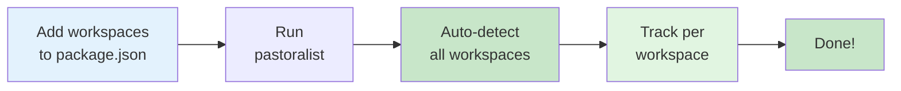

**.pastoralistrc:**

```json
{
  "depPaths": "workspace"
}
```

**Alternative - explicit paths:**

```json
{
  "depPaths": ["packages/*/package.json", "apps/*/package.json"]
}
```

**package.json:**

```json
{
  "workspaces": ["packages/*", "apps/*"],
  "overrides": {
    "lodash": "4.17.21"
  }
}
```

---

### 3.4 CI/CD Setup

One command generates your CI workflow. Automated security checks on every PR and weekly scans.

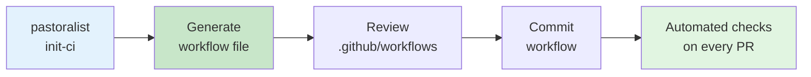

**Command:**

```bash
pastoralist init-ci
```

**Generated workflow:**

```yaml
name: Pastoralist Security Check

on:
  pull_request:
    branches: [main, master]
  push:
    branches: [main, master]
  schedule:
    - cron: '0 0 * * 0'

jobs:
  security-check:
    runs-on: ubuntu-latest
    steps:
      - uses: actions/checkout@v4
      - name: Setup Node.js
        uses: actions/setup-node@v4
      - name: Detect package manager
        id: detect
      - name: Install dependencies
      - name: Run Pastoralist security check
        run: npx pastoralist --checkSecurity
      - name: Check for uncommitted changes
      - name: Comment on PR
```

---

### 3.5 Breaking Change Management

Lock a version while you migrate. Pastoralist tracks which packages still need it. When all are updated, it auto-removes the override.

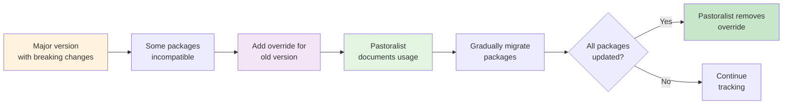

**.pastoralistrc:**

```json
{
  "depPaths": "workspace"
}
```

**package.json:**

```json
{
  "overrides": {
    "react": "^17.0.2"
  },
  "pastoralist": {
    "appendix": {
      "react@^17.0.2": {
        "dependents": {
          "old-package-a": "react@^17.0.0",
          "old-package-b": "react@^17.0.0"
        }
      }
    }
  }
}
```

---

### 3.6 Dry-Run Preview

Not sure what Pastoralist will do? Run `--dry-run` to preview. No files touched.

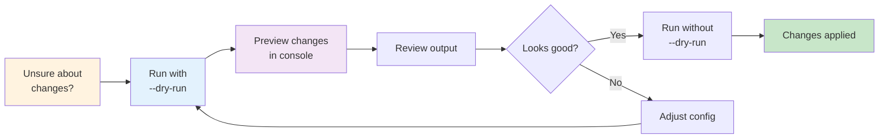

**Command:**

```bash
pastoralist --dry-run
```

**Output preview:**

```
[DRY RUN] Would write to package.json:
{
  "overrides": {
    "lodash": "4.17.21"
  },
  "pastoralist": {
    "appendix": {
      "lodash@4.17.21": {
        "dependents": {
          "my-app": "lodash@^4.17.0"
        }
      }
    }
  }
}
```
