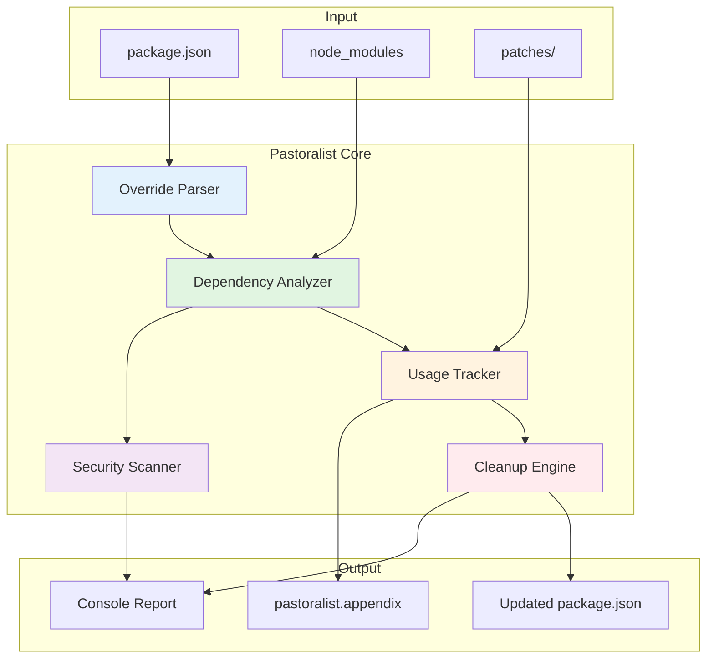
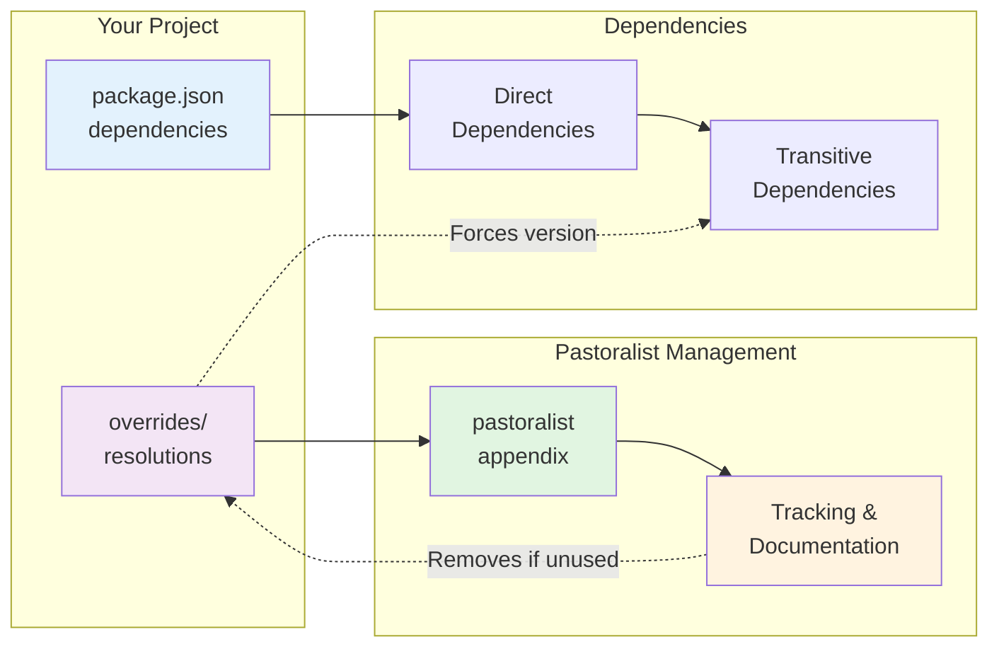
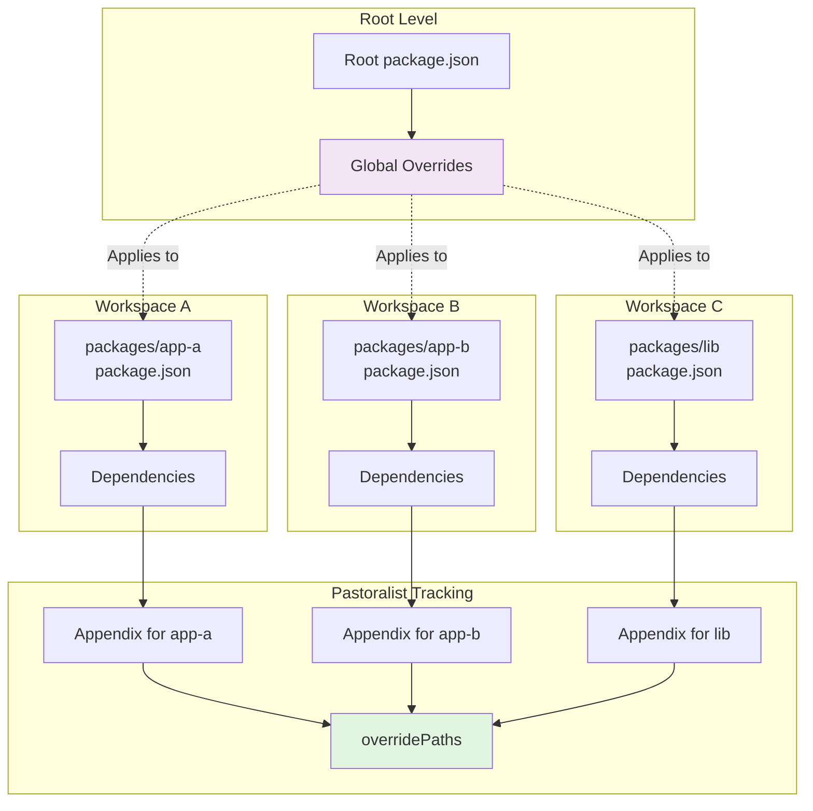
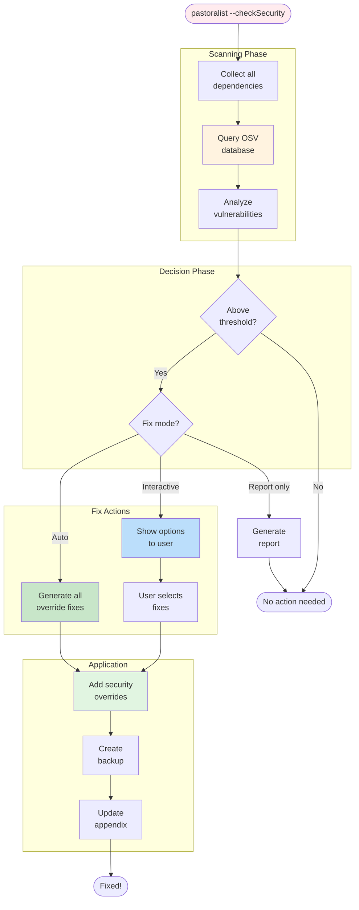
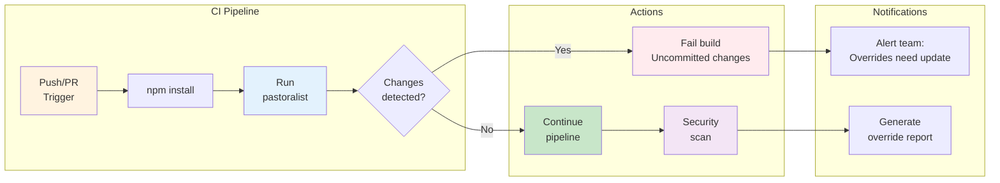
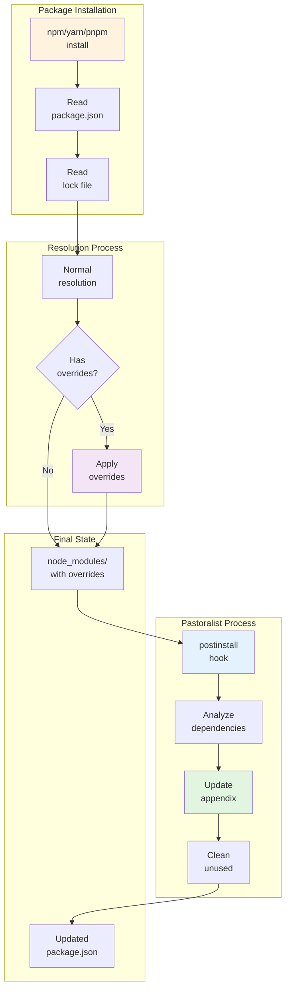
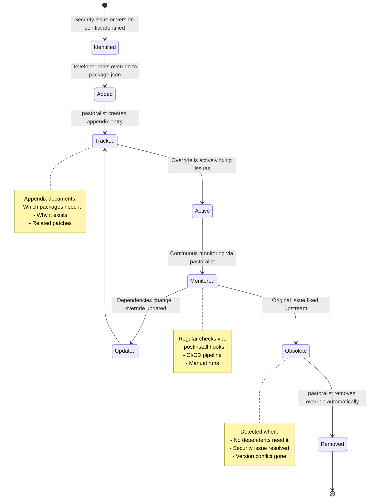
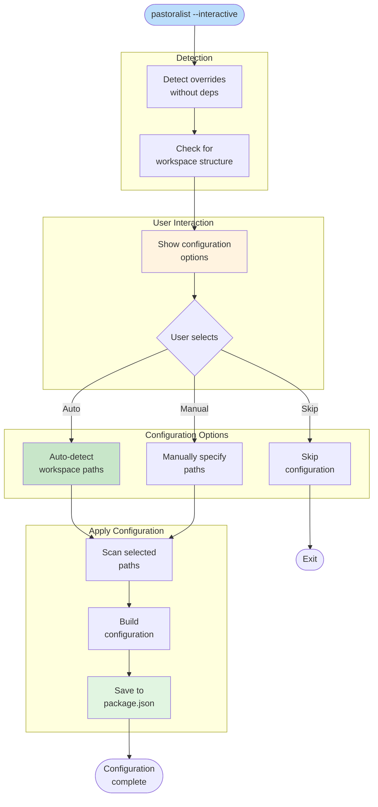
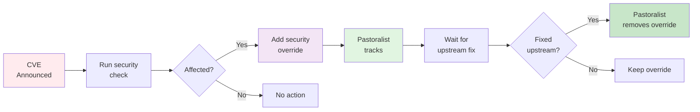
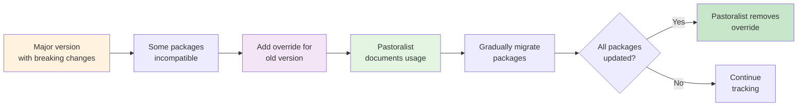

# Pastoralist Architecture & Use Cases

This document describes the various architectures and scenarios where Pastoralist helps manage package overrides and resolutions.

## Table of Contents

1. [Core Architecture](#core-architecture)
2. [Simple Project Architecture](#simple-project-architecture)
3. [Monorepo Architecture](#monorepo-architecture)
4. [Security Vulnerability Management](#security-vulnerability-management)
5. [Patch Management Architecture](#patch-management-architecture)
6. [Nested Override Architecture](#nested-override-architecture)
7. [CI/CD Integration](#cicd-integration)
8. [Dependency Resolution Flow](#dependency-resolution-flow)
9. [Override Lifecycle](#override-lifecycle)

## Core Architecture

How Pastoralist processes and manages overrides internally:



## Simple Project Architecture

Standard single-package project with overrides:



## Monorepo Architecture

Complex workspace setup with shared overrides:



## Security Vulnerability Management

How Pastoralist handles security scanning and fixes:



## Patch Management Architecture

Integration with patch-package and similar tools:

```mermaid
flowchart LR
    subgraph PatchSources [Patch Sources]
        PatchPkg[patch-package]
        Manual[Manual patches]
        Generated[Generated<br/>patches]
    end

    subgraph PatchFiles [Patch Files]
        PatchDir[patches/]
        PatchFiles[*.patch files]
    end

    subgraph PastoralistTrack [Pastoralist Tracking]
        DetectPatches[Detect patches]
        LinkPatches[Link to<br/>dependencies]
        TrackUsage[Track usage]
    end

    subgraph Appendix
        AppendixEntry[Package entry]
        PatchRef[Patch references]
        Dependents[Dependent packages]
    end

    PatchPkg --> PatchDir
    Manual --> PatchDir
    Generated --> PatchDir

    PatchDir --> PatchFiles
    PatchFiles --> DetectPatches

    DetectPatches --> LinkPatches
    LinkPatches --> TrackUsage

    TrackUsage --> AppendixEntry
    AppendixEntry --> PatchRef
    AppendixEntry --> Dependents

    style PatchDir fill:#fff3e0
    style DetectPatches fill:#e3f2fd
    style TrackUsage fill:#e1f5e1
    style AppendixEntry fill:#f3e5f5
```

## Nested Override Architecture

How nested overrides work for transitive dependencies:

```mermaid
flowchart TD
    subgraph YourProj [Your Project]
        YourPkg[your-package]
    end

    subgraph DirectDep [Direct Dependency]
        Express[express@4.18.0]
        PG[pg@8.13.1]
    end

    subgraph TransitiveDeps [Transitive Dependencies]
        Cookie[cookie@0.4.0]
        PGTypes[pg-types@3.0.0]
    end

    subgraph NestedOverrides [Nested Overrides]
        NestedOverride["Overrides:<br/>express.cookie: 0.5.0<br/>pg.pg-types: 4.0.1"]
    end

    subgraph Result
        CookieFixed[cookie@0.5.0<br/>Fixed]
        PGTypesFixed[pg-types@4.0.1<br/>Fixed]
    end

    YourPkg --> Express
    YourPkg --> PG
    Express --> Cookie
    PG --> PGTypes

    NestedOverride -.->|Overrides| Cookie
    NestedOverride -.->|Overrides| PGTypes

    Cookie --> CookieFixed
    PGTypes --> PGTypesFixed

    style YourPkg fill:#e3f2fd
    style NestedOverride fill:#f3e5f5
    style CookieFixed fill:#c8e6c9
    style PGTypesFixed fill:#c8e6c9
```

## CI/CD Integration

How Pastoralist fits into CI/CD pipelines:



## Dependency Resolution Flow

Complete flow of how dependencies are resolved with overrides:



## Override Lifecycle

The complete lifecycle of an override from creation to removal:



## Interactive Mode Architecture

How interactive mode guides users through configuration:



## Common Use Case Scenarios

### Scenario 1: Security Patch Management



### Scenario 2: Breaking Change Management



## Summary

Pastoralist provides comprehensive override management across various architectures:

1. **Simple Projects**: Basic override tracking and cleanup
2. **Monorepos**: Complex workspace override management
3. **Security**: Automated vulnerability detection and fixing
4. **Patches**: Integration with patch management tools
5. **CI/CD**: Automated validation and reporting
6. **Lifecycle Management**: Complete override lifecycle tracking

Each architecture benefits from Pastoralist's core features:
- Automatic documentation via appendix
- Usage tracking across dependencies
- Automatic cleanup of unused overrides
- Security vulnerability scanning
- Interactive configuration for complex setups