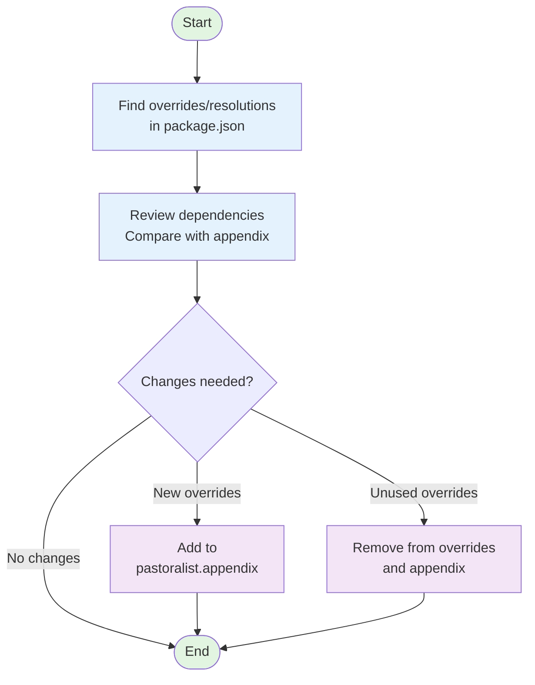

# Developer Experience (DX)

## How Pastoralist Works

Pastoralist manages your overrides and resolutions with 4 simple steps demonstrated in the flow chart below.

### Key Process Steps

1. **Find overrides/resolutions** - Scans package.json for override or resolution declarations
2. **Review dependencies** - Compares current dependencies with the appendix tracking
3. **Decision point** - Determines if changes are needed
4. **Add to appendix** - Tracks new overrides with their dependents
5. **Remove from overrides** - Cleans up unused overrides and their tracking

### Important Notes

- Pastoralist does **not** manage what is added to overrides or resolutions objects
- Pastoralist **does** manage dependencies that exist in a `package.json`'s overrides or resolutions objects
- Pastoralist will remove overrides and resolutions if they become unneeded according to child package.json's spec
