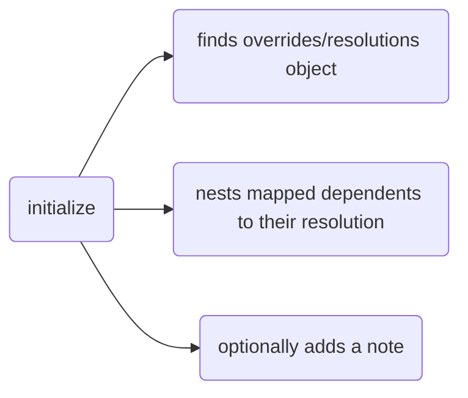

# Pasturalist Lifecycle

When pasturalist is initialized, it creates an object which maps overrides (resolutions) dependents to their resolution.

```mermaid
flowchart LR
A(initialize);
A --> B(finds overrides/resolutions object);
A --> C(nests mapped dependents to their resolution);
A --> D(optionally adds a note);
```
