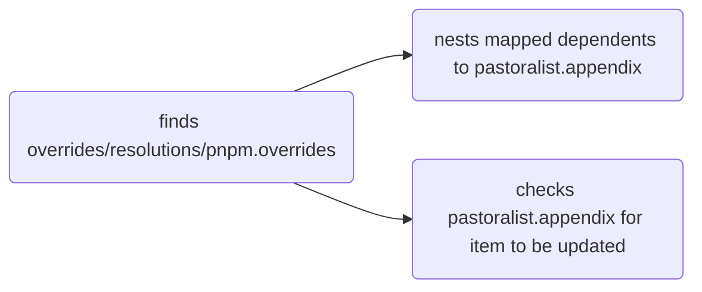
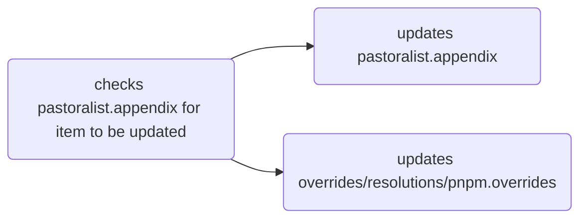

# Pasturalist Lifecycle

When **Pasturalist** is run, it does 2 things—**review** and **update** resolutions/overrides within a root `package.json` file.

1. **Review**
   - it creates an appendix which is a mapping of resolutions/overrides.
2. **Update**
   - it review the appendix for dependents which can be removed from resolutions/overrides.

---

## Review

**Pasturalist** creates a pastoralist object which maps `overrides/resolutions/pnpm.overrides` dependents to `pastoralist.appendix`.

---

## Update

**Pastoralist** checks `pastoralist.appendix` and removes unneeded `overrides/resolutions` from their corresponding declarations.

