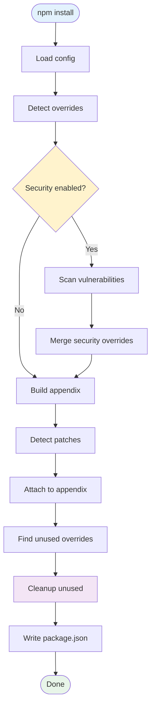

# Pastoralist Technical Specification

**Version:** 1.8.1
**Last Updated:** 2025-10-31

## Overview

Pastoralist is a **set-it-and-forget-it automation** tool for managing package.json overrides, resolutions, and patches. It automatically tracks dependencies, scans for security vulnerabilities, and cleans up unused overrides.

## Core Features

### 1. Automatic Tracking

**Location:** `src/scripts.ts:928-1036` (`updateAppendix`)

Pastoralist automatically documents every override in the `pastoralist.appendix` object:

- Tracks which packages depend on each override
- Supports nested overrides (transitive dependencies)
- Creates ledger entries with timestamps and reasons
- Caches appendix items for performance

**Example:**
```json
{
  "overrides": {
    "lodash": "4.17.21"
  },
  "pastoralist": {
    "appendix": {
      "lodash@4.17.21": {
        "dependents": {
          "my-app": "lodash@^4.17.0"
        },
        "ledger": {
          "addedDate": "2024-01-15T10:30:00.000Z",
          "reason": "Security vulnerability CVE-2021-23337"
        }
      }
    }
  }
}
```

### 2. Automatic Security Scanning

**Location:** `src/security/index.ts`

Security scanning via multiple providers:
- **OSV** (default) - Open Source Vulnerabilities, no auth required
- **GitHub** - Dependabot alerts, requires token
- **Snyk** - Vulnerability database, requires CLI
- **Socket** - Security analysis, requires CLI

**How it works:**
1. Scans all dependencies against provider API
2. Detects vulnerable packages
3. Auto-generates overrides with patched versions
4. Tracks security fixes in appendix ledger

**Configuration:**
```json
{
  "pastoralist": {
    "security": {
      "enabled": true,
      "provider": "osv",
      "severityThreshold": "medium",
      "autoFix": false,
      "interactive": false
    }
  }
}
```

### 3. Automatic Cleanup

**Location:** `src/scripts.ts:212-266` (`cleanupUnusedOverrides`), `src/scripts.ts:1290-1345` (`findUnusedOverrides`)

**YES - Pastoralist DOES automatically clean up unused overrides.**

**How cleanup works:**

1. **Dependency tree analysis** (`getDependencyTree`, line 1239):
   - Runs `npm ls --json --all` to get full dependency tree
   - Caches results for performance
   - Maps all installed packages

2. **Detection logic** (`findUnusedOverrides`, line 1290):
   - Checks if package is in direct dependencies
   - Checks if package is in dependency tree (transitive)
   - Identifies nested overrides whose parent packages are missing
   - Returns list of removable packages

3. **Removal process** (`cleanupUnusedOverrides`, line 212):
   - Filters out packages tracked in `overridePaths` (monorepo support)
   - Updates overrides object
   - Removes entries from appendix
   - Logs cleanup actions

4. **Integration** (line 556):
   ```typescript
   const { finalOverrides, finalAppendix } = await cleanupUnusedOverrides(
     overrides,
     overridesData,
     appendix,
     allDeps,
     missingInRoot,
     overridePaths,
     log
   );
   ```

**Example cleanup:**
```typescript
// Before: Package removed from dependencies
{
  "dependencies": {},
  "overrides": {
    "lodash": "4.17.21"  // No longer needed
  }
}

// After: Pastoralist auto-removes it
{
  "dependencies": {},
  "overrides": {},
  "pastoralist": {}
}
```

### 4. Patch Detection & Tracking

**Location:** `src/scripts.ts:1145-1235`

Automatically detects patches from `patch-package`:

- Scans `patches/`, `.patches/`, and `*.patch` files
- Parses package names from patch filenames
- Links patches to corresponding overrides in appendix
- Warns about unused patches

**Detection patterns:**
- `package-name+1.2.3.patch`
- `@scope+package-name+1.2.3.patch`
- `package-name.patch`

### 5. Monorepo Support

**Location:** `src/scripts.ts:144-170` (`processWorkspacePackages`)

Three configuration methods:

1. **`depPaths: "workspace"`** - Auto-detects all workspace packages
2. **`depPaths: ["packages/*/package.json"]`** - Custom glob patterns
3. **`overridePaths`** - Manual tracking for specific paths

**Features:**
- Scans multiple package.json files
- Aggregates dependencies across workspaces
- Preserves overrides for packages only in workspaces
- Prevents false positive cleanup

### 6. Multi-Package Manager Support

**Location:** `src/scripts.ts:31-108`

Supports npm, yarn, pnpm, and bun:

- **npm/bun**: `overrides` field
- **yarn**: `resolutions` field
- **pnpm**: `pnpm.overrides` field

Auto-detects based on lockfile presence.

### 7. Interactive Mode

**Location:** `src/interactive/`

Prompts for reasons when adding manual overrides:

- Detects new overrides without reasons
- Asks user for justification
- Stores reasons in ledger
- Skips security-generated overrides

### 8. Configuration System

**Location:** `src/config/loader.ts`

Multiple config file support (priority order):
1. `.pastoralistrc`
2. `.pastoralistrc.json`
3. `pastoralist.json`
4. `pastoralist.config.js`
5. `pastoralist.config.ts`
6. `package.json` `pastoralist` field

Deep merge strategy with package.json overrides.

## Architecture

### Entry Points

1. **CLI**: `src/index.ts` → `src/program.ts`
2. **API**: `src/scripts.ts` exports `update()` function

### Main Workflow



### Key Functions

| Function | Location | Purpose |
|----------|----------|---------|
| `update` | scripts.ts:371 | Main entry point |
| `cleanupUnusedOverrides` | scripts.ts:212 | Removes unused overrides |
| `findUnusedOverrides` | scripts.ts:1290 | Detects removable packages |
| `updateAppendix` | scripts.ts:928 | Builds/updates appendix |
| `constructAppendix` | scripts.ts:1356 | Aggregates workspace appendixes |
| `detectPatches` | scripts.ts:1145 | Finds patch files |
| `resolveOverrides` | scripts.ts:739 | Parses override config |
| `updatePackageJSON` | scripts.ts:630 | Writes changes to disk |

## Data Structures

### Appendix Item

```typescript
interface AppendixItem {
  dependents?: Record<string, string>;  // Who uses this override
  patches?: Array<string>;              // Patch files
  ledger?: {
    addedDate: string;                  // ISO timestamp
    reason?: string;                    // Why override exists
    securityChecked?: boolean;          // Was security scan run
    securityCheckDate?: string;         // Last scan time
    securityProvider?: "osv" | "github" | "snyk" | "npm" | "socket";
  };
}
```

### Override Types

```typescript
type OverrideValue = string | Record<string, string>;

interface OverridesType {
  [key: string]: string | Record<string, string>;
}
```

**Simple override:**
```json
{
  "overrides": {
    "lodash": "4.17.21"
  }
}
```

**Nested override:**
```json
{
  "overrides": {
    "pg": {
      "pg-types": "^4.0.1"
    }
  }
}
```

## Proposed Features

### 1. MCP (Model Context Protocol) Integration

**Status:** Proposed
**Priority:** High

Add MCP server for AI-powered dependency management:

```typescript
// Proposed structure
interface MCPServer {
  tools: {
    analyzeDependencies(): Promise<DependencyAnalysis>;
    suggestFixes(): Promise<SecurityFix[]>;
    explainOverride(packageName: string): Promise<string>;
    optimizeDependencies(): Promise<Optimization[]>;
  };
}
```

**Benefits:**
- AI-powered vulnerability assessment
- Intelligent override suggestions
- Natural language dependency queries
- Automated conflict resolution

**Implementation:**
- New directory: `src/mcp/`
- MCP SDK integration
- Expose Pastoralist functions as MCP tools
- Add to CLI as `--mcp-server` flag

### 2. Auto-Update Overrides

**Status:** Proposed
**Priority:** Medium

Automatically update overrides when newer patched versions are available:

- Check for updates during security scan
- Suggest version bumps for security overrides
- Configurable update strategy (patch/minor/major)

### 3. Dependency Health Scoring

**Status:** Proposed
**Priority:** Low

Calculate overall project dependency health:

- Age of dependencies
- Known vulnerability count
- Override complexity score
- Patch burden

### 4. CI/CD Integration Templates

**Status:** Proposed
**Priority:** Medium

Pre-built workflows:

- GitHub Actions
- GitLab CI
- CircleCI
- Jenkins

Auto-fail builds on security issues.

### 5. Dashboard UI

**Status:** Proposed
**Priority:** Low

Web interface for visualization:

- Dependency graph (D3.js)
- Security status overview
- Override timeline
- Monorepo workspace view

### 6. Notification System

**Status:** Proposed
**Priority:** Low

Alert on security issues:

- Slack webhooks
- Discord webhooks
- Email notifications
- GitHub issue creation

### 7. Export Reports

**Status:** Proposed
**Priority:** Low

Generate reports:

- PDF dependency audit
- HTML security report
- CSV export for compliance
- SBOM (Software Bill of Materials) generation

## Configuration Reference

### Complete Config Example

```json
{
  "pastoralist": {
    "depPaths": "workspace",
    "security": {
      "enabled": true,
      "provider": "osv",
      "autoFix": false,
      "interactive": false,
      "severityThreshold": "medium",
      "excludePackages": ["@types/*"],
      "hasWorkspaceSecurityChecks": false
    },
    "appendix": {
      // Auto-generated - do not edit manually
    },
    "overridePaths": {
      // Monorepo path-specific appendixes
    }
  }
}
```

### CLI Flags

```bash
pastoralist [options]

Options:
  --init                     Initialize configuration
  --debug                    Enable debug logging
  --path <path>              Path to package.json (default: "package.json")
  --root <path>              Root directory (default: "./")
  --depPaths <patterns...>   Workspace patterns to scan
  --ignore <patterns...>     Patterns to ignore
  --checkSecurity            Run security scan
  --forceSecurityRefactor    Auto-apply security fixes
  --interactive              Use interactive mode
  --securityProvider <name>  Security provider (osv|github|snyk|socket)
```

## Testing

- **Unit tests**: `bun test`
- **E2E tests**: `bun run test:e2e`

Test coverage includes:
- Override resolution
- Appendix construction
- Cleanup logic
- Security scanning
- Monorepo support
- Patch detection

## Performance

### Optimizations

1. **JSON caching** (line 1101): Caches parsed package.json files
2. **Dependency tree caching** (line 1237): Caches npm ls results
3. **Appendix item caching** (line 939): Prevents duplicate work
4. **Fast-glob** for file scanning

### Benchmarks

- Typical run time: 1-3 seconds
- With security scan: 5-15 seconds (depends on dep count)
- Monorepo (50 packages): 10-20 seconds

## Security

- No execution of arbitrary code
- Read-only security API calls
- Token sanitization for GitHub/Snyk
- Safe JSON parsing with error handling

## Maintenance

### Release Process

1. Update version in package.json
2. Run `bun run test`
3. Run `bun run build`
4. Run `bun run release` (release-it)

### Commit Convention

Uses Conventional Commits:
- `feat:` - New features
- `fix:` - Bug fixes
- `chore:` - Maintenance tasks
- `docs:` - Documentation changes

## Support

- **Issues**: https://github.com/yowainwright/pastoralist/issues
- **Docs**: https://jeffry.in/pastoralist/
- **NPM**: https://www.npmjs.com/package/pastoralist
